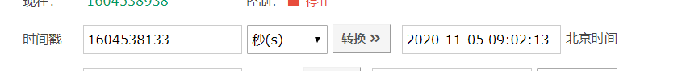
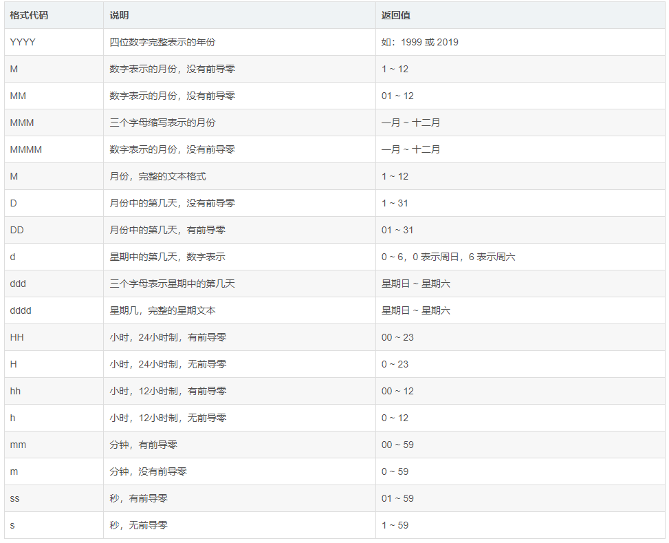

# vue 中使用 moment 时间转换

1.下载安装

```
npm install moment --save
```

2.main.js全局引入

```javascript
import Moment from 'moment'
Vue.prototype.moment = Moment
```

3.使用

```js
this.moment(1604538133).format('YYYY-MM-DD HH:mm:ss')
```

4.问题（bug）

当我第三步使用时 传入10为时间戳，打印出来 是 1970-01-19 21:42:18 ，经过验证应该是 2020-11-05 09:02:13 很明显是不正确的。



后来在 这篇博客中找到 原因，感谢博主！（ https://blog.csdn.net/Mr_Gorgre/article/details/103773121 ） 原来moment这个插件，直接使用moment函数会自动把我的时间戳截取掉最后三位数。

5.解决方法

```js
moment.unix(1604538133)  
```

unix方法，相当于你的时间戳*1000 这样返回的数据就正常了。

## 补充

也可以定义一个全局过滤器，提供使用。

```js
import Vue from 'vue'
import App from './App'
import router from './router'
import Moment from 'moment'

// 定义全局时间戳过滤器
Vue.filter('formatDate', function(value) {
  return Moment(value).format('YYYY-MM-DD HH:mm:ss')
})

Vue.config.productionTip = false

/* eslint-disable no-new */
new Vue({
  el: '#app',
  router,
  components: { App },
  template: '<App/>'
})
```

**在组件里使用**

```vue
<div class="time">{{item.rateTime | formatDate}}</div>
```

**常用的一些日期格式化方法**

1.日期格式化

```js
moment().format('MMMM Do YYYY, h:mm:ss a'); // 四月 16日 2019, 12:24:48 中午
moment().format('dddd');                    // 星期二
moment().format("MMM Do YY");               // 4月 16日 19
moment().format('YYYY [escaped] YYYY');     // 2019 escaped 2019
moment().format();                          // 2019-04-16T12:24:48+08:00
```

2.相对时间

```js
moment("20111031", "YYYYMMDD").fromNow(); // 7 年前
moment("20120620", "YYYYMMDD").fromNow(); // 7 年前
moment().startOf('day').fromNow();        // 12 小时前
moment().endOf('day').fromNow();          // 12 小时内
moment().startOf('hour').fromNow();       // 28 分钟前
```

3.日历时间

```js
moment().subtract(10, 'days').calendar(); // 2019年4月6日
moment().subtract(6, 'days').calendar();  // 上周三中午12点28
moment().subtract(3, 'days').calendar();  // 上周六中午12点28
moment().subtract(1, 'days').calendar();  // 昨天中午12点28分
moment().calendar();                      // 今天中午12点28分
moment().add(1, 'days').calendar();       // 明天中午12点28分
moment().add(3, 'days').calendar();       // 本周五中午12点28
moment().add(10, 'days').calendar();      // 2019年4月26日
```

4.多语言支持

```js
moment().format('L');    // 2019-04-16
moment().format('l');    // 2019-04-16
moment().format('LL');   // 2019年4月16日
moment().format('ll');   // 2019年4月16日
moment().format('LLL');  // 2019年4月16日中午12点28分
moment().format('lll');  // 2019年4月16日中午12点28分
moment().format('LLLL'); // 2019年4月16日星期二中午12点28分
moment().format('llll'); // 2019年4月16日星期二中午12点28分
```

**说明文档**




