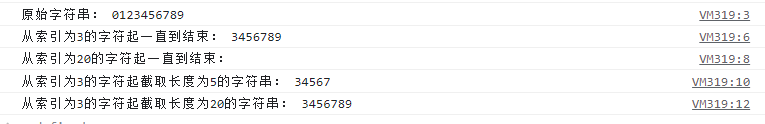

# JS字符串截取方法汇总（slice、substring、substr等）

在开发中常常会需要截取字符串，而 JavaScript 提供了很多种方法实现截取操作。本文对各种方法做个整理，供大家参考。

## 一、使用 slice() 截取

**1.函数说明**

slice() 方法可通过指定的开始和结束位置，提取字符串的某个部分，并以新的字符串返回被提取的部分。语法如下：

```js
stringObject.slice(start, end)
```

参数说明：

> * start（必需）：规定从何处开始选取。如果是负数，那么它规定从字符串尾部开始算起的位置。也就是说，-1 指最后一个字符，-2 指倒数第二个字符，以此类推。
> * end（可选）：规定从何处结束选取，即结束处的字符下标。如果没有指定该参数，那么截取的字符串包含从 start 到结束的所有字符。如果这个参数是负数，那么它规定的是从数组尾部开始算起的字符

**2.使用样例**

```js
var str = "0123456789";
console.log("原始字符串：", str);

console.log("从索引为3的字符起一直到结束：", str.slice(3));  //3456789
console.log("从倒数第3个字符起一直到结束：", str.slice(-3));  //789

console.log("从开始一直到索引为5的前一个字符：", str.slice(0,5));  //01234
console.log("从开始一直到倒数第3个字符的前一个字符：", str.slice(0,-3));  //0123456

console.log("从索引为3的字符起到索引为5的前一个字符：", str.slice(3,5));  //34

console.log("从索引为3的字符起到倒数第3个字符的前一个字符：", str.slice(3,-3));  //3456
```

运行结果如下：


## 二、使用 substring() 截取

**1.函数说明**

substring 方法用于提取字符串中介于两个指定下标之间的字符。语法如下：

```js
stringObject.substring(start, stop)
```

参数说明：

> * start（必需）：一个非负的整数，规定要提取的子串的第一个字符在 stringObject 中的位置。
> * stop（可选）：一个非负的整数，比要提取的子串的最后一个字符在 stringObject 中的位置多 1。

返回值说明：
该方法返回一个新的字符串，该字符串值包含 stringObject 的一个子字符串，其内容是从 start 处到 stop-1 处的所有字符，其长度为 stop 减 start。

（2）注意事项：

> * 如果 start 与 end 相等，那么该方法返回的就是一个空串（即长度为 0 的字符串）。
> * 如果 start 比 end 大，那么该方法在提取子串之前会先交换这两个参数。
> * 如果 start 或 end 为负数，那么它将被替换为 0。

**2.使用样例**

```js
var str = "0123456789";
console.log("原始字符串：", str);

console.log("从索引为3的字符起一直到结束：", str.substring(3));  //3456789
console.log("从索引为20的字符起一直到结束：", str.substring(20));  //

console.log("从索引为3的字符起到索引为5的前一个字符结束：", str.substring(3,5));  //34

console.log("start比end大会自动交换，结果同上：", str.substring(5,3));  //34

console.log("从索引为3的字符起到索引为20的前一个字符结束：", str.substring(3,20));  //3456789
```

运行结果如下：


## 三、使用substr()截取

**1.函数说明**

substr 方法用于返回一个从指定位置开始的指定长度的子字符串。语法如下：

```js
stringObject.substr(start, length)
```

start（必需）：所需的子字符串的起始位置。字符串中的第一个字符的索引为 0。
length（可选）：在返回的子字符串中应包括的字符个数。

注意事项：

> * 如果 length 为 0 或负数，将返回一个空字符串。 
> * 如果没有指定 length，则子字符串将延续到 stringObject 的最后。
> * 如果 start 或 length 为负数，那么它将被替换为 0。

**2.使用样例**

```js
var str = "0123456789";
console.log("原始字符串：", str);


console.log("从索引为3的字符起一直到结束：", str.substr(3));  //3456789

console.log("从索引为20的字符起一直到结束：", str.substr(20));  //

console.log("从索引为3的字符起截取长度为5的字符串：", str.substr(3,5));  //34567

console.log("从索引为3的字符起截取长度为20的字符串：", str.substr(3,20));  //3456789
```

运行结果如下：



## 附：其他一些常用的方法

下面这些函数可以辅助我们进行字符串的截取工作。

### 一、 indexOf()

返回字符串中匹配子串的第一个字符的下标。

```js
var str = "JavaScript";
var i1 = str.indexOf("a"); //1
var i2 = str.indexOf("S"); //4
var i3 = str.indexOf("Script"); //4
var i4 = str.indexOf("k"); //-1

console.log("原始字符串：", str);
console.log("a的索引：", i1);
console.log("S的索引：",i2);
console.log("Script的索引：",i3);
console.log("k的索引：",i4);
```

运行结果如下：


### 二、lastIndexOf()

该方法返回从右向左出现某个字符或字符串的首个字符索引值（与 indexOf 相反）

```js
var str = "JavaScript";
var i1 = str.lastIndexOf("a"); //3
var i2 = str.lastIndexOf("S"); //4
var i3 = str.lastIndexOf("Script"); //4
var i4 = str.lastIndexOf("k"); //-1
```

### 三、split()

使用一个指定的分隔符把一个字符串分割存储到数组。

```js
var str = "jpg|bmp|gif|ico|png";
var arr= str.split("|");
console.log(arr);
```

运行结果如下：


### 四、join()

使用一个指定的分隔符将一个数组合并为一个字符串。

```js
var arr= new Array("jpg","bmp","gif","ico","png");
var str = arr.join("|");
console.log(str);
```

运行结果如下：


### 五、concat()

将两个数组连接在一起。

```js
var arr1 = [1, 2, 3];
var arr2 = [4, 5, 6];
var arr3 = arr1.concat(arr2);
console.log(arr3);
```

运行结果如下：


### 六、charAt()

返回指定位置的字符。字符串中第一个字符的下标是 0。如果参数 index 不在 0 与 string.length 之间，该方法将返回一个空字符串。

```js
var str = "abcdefg";
var char = str.charAt(2);  //c
console.log(char);
```

运行结果如下：


## 转载

转载自：https://www.hangge.com/blog/cache/detail_1887.html

