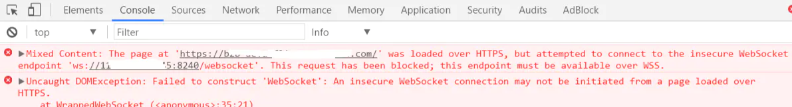

# Nginx配置websocket的wss访问

## 前景回顾

最近自己的服务器需要上上线一个websocket服务，本地测试什么的都是正常的，知道上线的时候，发现报了如下错误



从图中可以发现，如果内嵌websocket的站点是https加密的，则需要使用wss协议，而不是ws协议。毫无疑问我们就需要使用 wss:\ 安全协议了，那不简单，直接把ws:\ 改为 wss:\ 不就行了？ 说干就干。


好吧，还是太天真 上面的错误很明显 SSL 协议错误，说明就是证书问题了。测试的时候我们一直拿的是 IP地址 + 端口号 这种方式连接 WebSocket 的，所以一直不存在问题，但是生成环境我们肯定不能再用 IP地址 + 端口号这种形式了。看来简单的改协议头解决不了问题。那么怎么才能解决问题呢？

## 方法一：Nginx 配置域名支持 WSS

```
#在nginx内添加该段内容
location /websocket {
    proxy_pass http://backend;
    proxy_http_version 1.1;
    proxy_set_header Upgrade $http_upgrade;
    proxy_set_header Connection "upgrade";
}
```

上文的具体作用就是将原来的websocket端口，挂载在https对应服务器下的/websocket路由下，[http://backend](https://links.jianshu.com/go?to=http%3A%2F%2Fbackend) 就是你的websocket url 。这样就完成了，在 HTTPPS 下以域名方式连接 WebSocket。

**稍微解释一下 Nginx 配置**

Nginx 自从 1.3 版本就开始支持 WebSocket 了，并且可以为 WebSocket 应用程序做反向代理和负载均衡。 WebSocket 和 HTTP 协议不同，但是 WebSocket 中的握手和 HTTP 中的握手兼容，它使用 HTTP 中的 Upgrade 协议头将连接从 HTTP 升级到 WebSocket，当客户端发过来一个 `Connection: Upgrade`请求头时，Nginx 是不知道的，所以，当 Nginx 代理服务器拦截到一个客户端发来的 `Upgrade` 请求时，需要显式来设置`Connection` 、`Upgrade` 头信息，并使用 101（交换协议）返回响应，在客户端和代理服务器、后端服务器之间建立隧道来支持 WebSocket。

当然，还需要注意一下，WebSockets 仍然受到 Nginx 缺省为60秒的 proxy_read_timeout 的影响。这意味着，如果你有一个程序使用了 WebSockets，但又可能超过60秒不发送任何数据的话，那你要么需要增加超时时间，要么实现一个 ping 的消息以保持联系。使用 ping 的解决方法有额外的好处，可以发现连接是否被意外关闭。

更具体文档详见 Nginx 官方文档：[http://nginx.org/en/docs/http/websocket.html](https://links.jianshu.com/go?to=http%3A%2F%2Fnginx.org%2Fen%2Fdocs%2Fhttp%2Fwebsocket.html)

## 方法二：

这个方法就比较复杂了，需要在你的websocket服务器下加入证书支持。

这种方法，还是忽略就好。