# Appium自动化测试

## 一、APP环境搭建及APP自动化测试原理

1、安装jdk，配置jdk环境变量

2、Android SDK环境的安装

3、Appium server安装

4、模拟器的安装（夜神、雷电）

5、安装appium-python-client

```shell
pip install appium-python-client
```

## 二、APP自动化测试原理

如何通过代码操作不同操作系统（ios、Android）不同版本的手机终端？

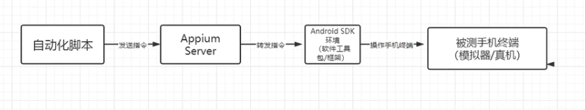

Android SDK环境：不同系统不同版本的差异比较大

不同系统不同版本可能用到不同软件包/框架？所以需要自动化脚本需要指定操作终端的设置参数。

## 三、Desired Capabilities-Appium 自动化配置项

设置参数：

操作系统 platformName 值

系统版本 platformVersion 值

、设备名称、包名（应用程序）、入口启动页面

[Desired Capabilities-Appium](http://appium.io/docs/en/writing-running-appium/caps/#general-capabilities)

## 四、常用的ADB命令

1、连接模拟器

```
adb connect 127.0.0.1:62001
```

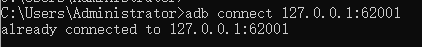

夜神模拟器62001，雷神模拟器5555，mumu7555，逍遥

2、查看连接的设备

```
adb devices
```

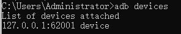

3、查看被测app的包名以及入口启动页面

```
aapt dump badging 安装包路径
# 或者通过管道符快速查找
aapt dump badging 安装包路径 | findstr package
```

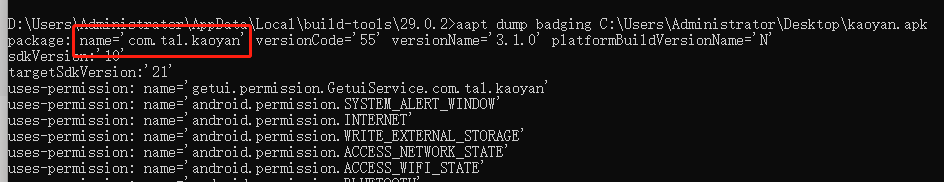

上图标记处为包名，package:name=包名

**查找启动页**

```
aapt dump badging 安装包路径
# 或
aapt dump badging 安装包路径 | findstr launchable-activity
```

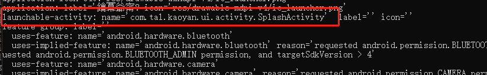

找到launchable-activity:name=""，里面的值就是启动页

## 五、python代码实现操作手机终端某个应用程序实现自动化测试


## 六、Appium元素定位工具

### 1、UIAutomatorView

Android SDK自带的定位工具 

位置：Android SDK/tools/{有可能也在bin文件夹中}/uiautomatorviewer.bat 

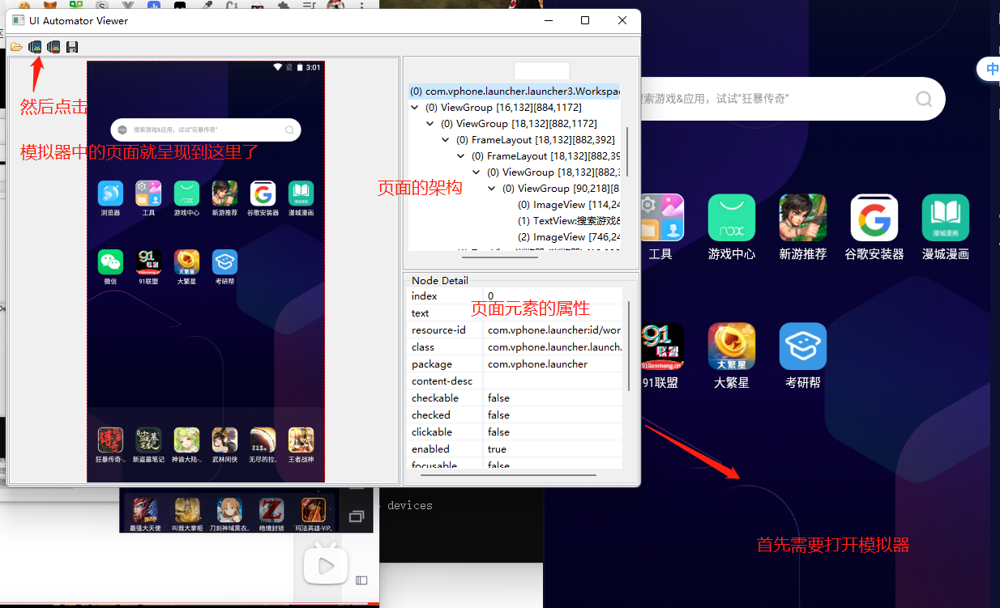

元素常见几个属性： 

text：文本 

resoureid: 元素id

class: 元素标签 

content-desc/description: 元素功能描述。用于语音播报 （盲人、无障碍）

**注意**：在截屏的时候，必须当前截屏的终端没有其他的进程在占用，包括 appium server 。

### 2、Appium Desktop Inspector

appium server自带的定位工具 

启动appium server后，点击右上角的放大镜。

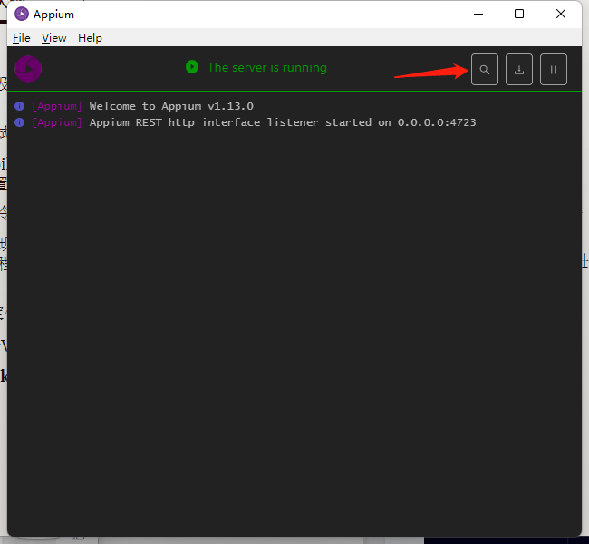

然后导入终端参数项

```
{
  "platformName": "Android",
  "platformVersion": "7.1.2",
  "deviceName": "xiaomi",
  "appPackage": "com.tal.kaoyan",
  "appActivity":"com.tal.kaoyan.ui.activity.SplashActivity",
  "noReset": true
}
```

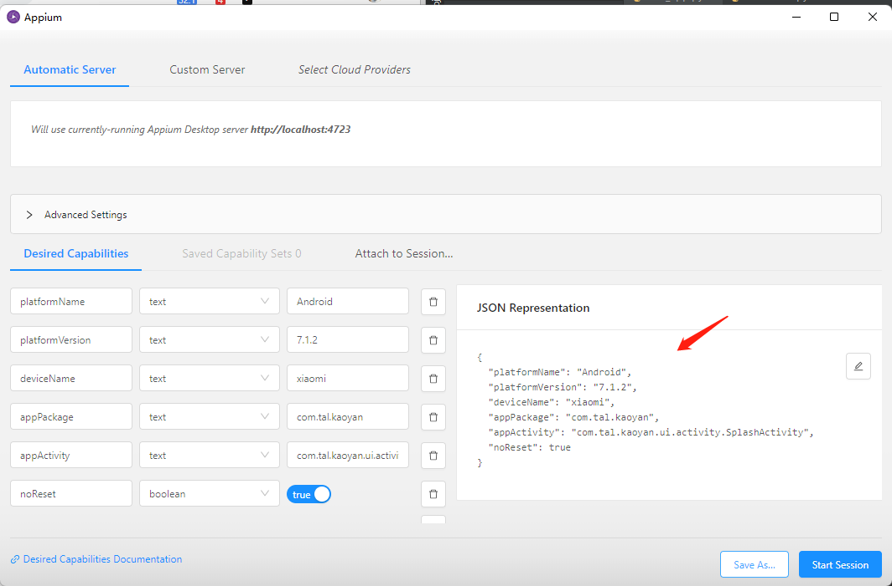

可以点击Save As进行保存，方便后续使用。

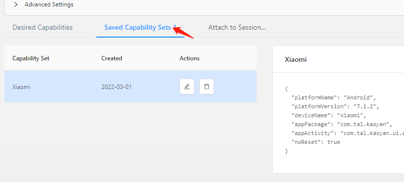

点击Saved Capability Sets可查看保存的。

然后点击Start Session

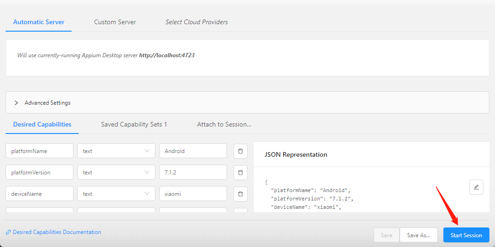

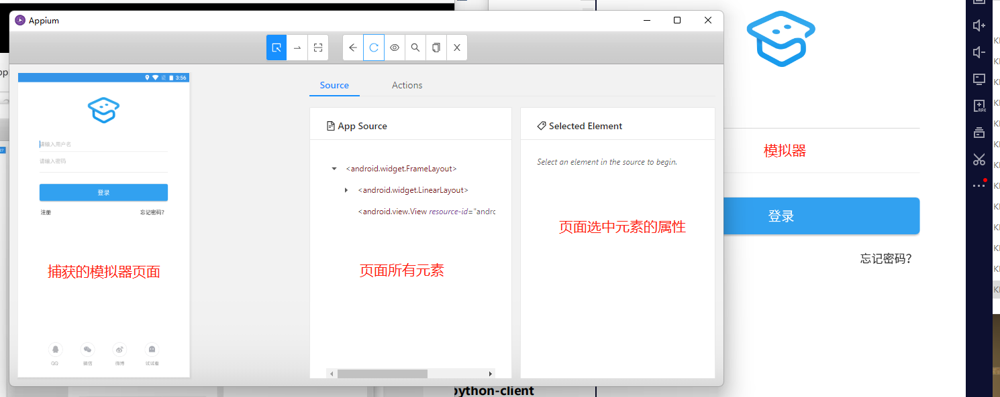

### 3、Weditor

Uiautomator2 python第三方库 appUi自动化测试框架 

安装

```shell
pip install uiautomator2
python -m uiautomator2 init
pip install weditor
```

**可能遇到的错**

我安装weditor途中，遇到了以下错误。

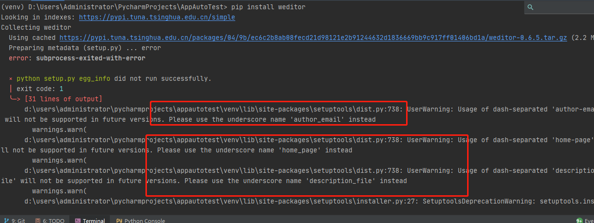

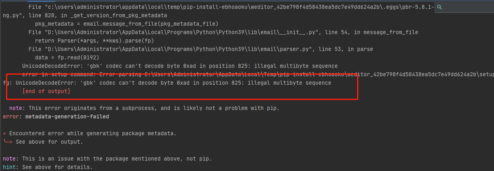

运行下方命令，可解决

```
git clone https://gitcode.net/mirrors/alibaba/web-editor
cd web-editor
python setup.py install
pip install weditor
```

确认安装成功，

```
weditor --help
```

如果终端返回以下内容，表示安装成功。

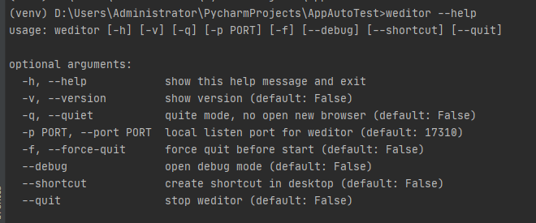

终端输入weditor，自动打开一个web面板。

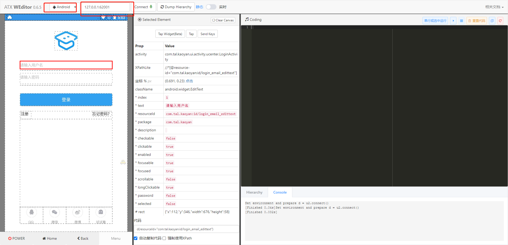

选择设备操作系统，填写连接地址，然后点击Connect进行链接。点击Dump Hierarchy，可刷新页面。

## Appium界面元素定位方法

id、ClassName、accessibility、xpath

### 1、通过resourceId属性定位

返回的是WebElement对象

```python
el_passwd = driver.find_element(by=AppiumBy.ID,
                                value="com.tal.kaoyan:id/login_password_edittext")
el_passwd.send_keys("xiaorui16888")
```

### 2、通过文本定位--组合定位

通过调用系统自带框架`（Uiautomator1/Uiautomator2）`实现元素定位，基于java代码编写`UiSelector`实现元素定位,提供很多方法，通过多个属性实现元素定位。

```python
el_username = driver.find_element(by=AppiumBy.ANDROID_UIAUTOMATOR, value='new UiSelector().text("请输入用户名")')
el_username.send_keys('xiaorui')
```

组合定位：结合多个属性来进行定位 resourceId+text属性

[UiSelector属性](https://www.apiref.com/android-zh/android/support/test/uiautomator/UiSelector.html)

```python
el_login = driver.find_element(
    by=AppiumBy.ANDROID_UIAUTOMATOR,
    value='new UiSelector().text("登录").resourceId("com.tal.kaoyan:id/login_login_btn")')
el_login.click()
```

### 3、通过content-desc/description属性实现元素定位 

```python
el_passwd = driver.find_element(AppiumBy.ACCESSIBILITY_ID, "找回密码")
el_passwd.click()
```

### 4、通过xpath定位

一般不建议采用这种方法来进行对应的定位。

```python
register_btn = driver.find_element(AppiumBy.XPATH, '//*[@resource-id="com.tencent.mobileqq:id/i5v"]')
register_btn.click()
```

## APP元素的操作

### 1、APP四大常用元素操作：

点击--click();

输入--send_key("值");

获取元素的属性--get_attribute("属性名");

获取对应的文本--text 

### 2、其他操作

滑屏：左滑、右滑、上滑、下滑

```
swipe(self: T, start_x: int, start_y: int, end_x: int, end_y: int, duration: int = 0): 
```

> 参数说明: 
>
> start_x: 开始位置的x坐标 
>
> start_y: 开始位置的y坐标 
>
> end_x: 结束位置的x坐标 
>
> end_y: 结束位置的y坐标 
>
> duration: 延时多少毫秒 

多点触控

长按
