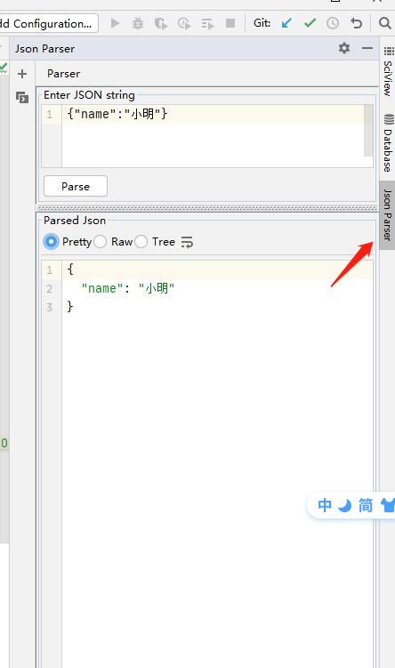
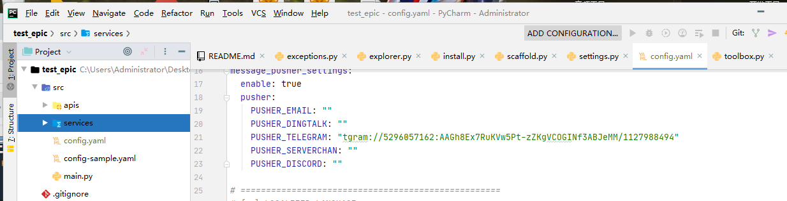

# Pycharm好用插件集锦

## 1、Json Parser

一个用于验证和格式化JSON字符串的轻量级插件

## 2、Material Theme UI

一个主题插件，在很多编辑器中都可以使用。非常有质感！

同时需要配合Atom Material Icons插件使用。安装即可。

可以调整颜色为黑色，更舒适。

## 3、Translation

这是一款用于翻译的插件，可以摆脱浏览器或者翻译软件，进行中英互译。

阅读文档时，如果看不懂的地方，选中后右键翻译或者使用组合键（Ctrl+Shift+Y）进行翻译。

## 4、AiXcoder Code Compeleter

这是一款代码补全插件。初学者不建议使用，多学多写代码可以提高自己。

等我是老油条了，我再安装使用~

