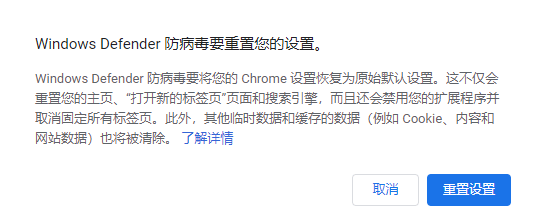
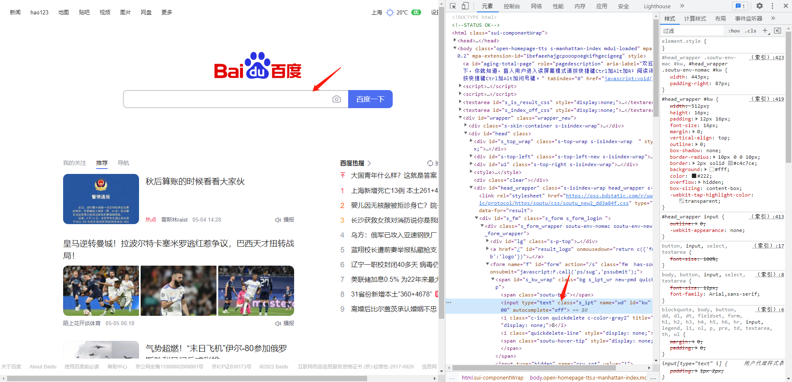
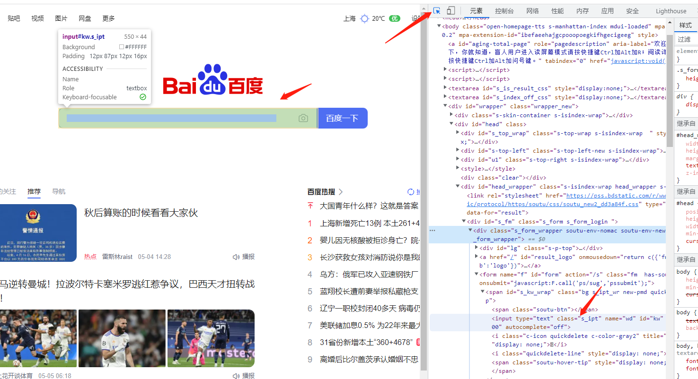
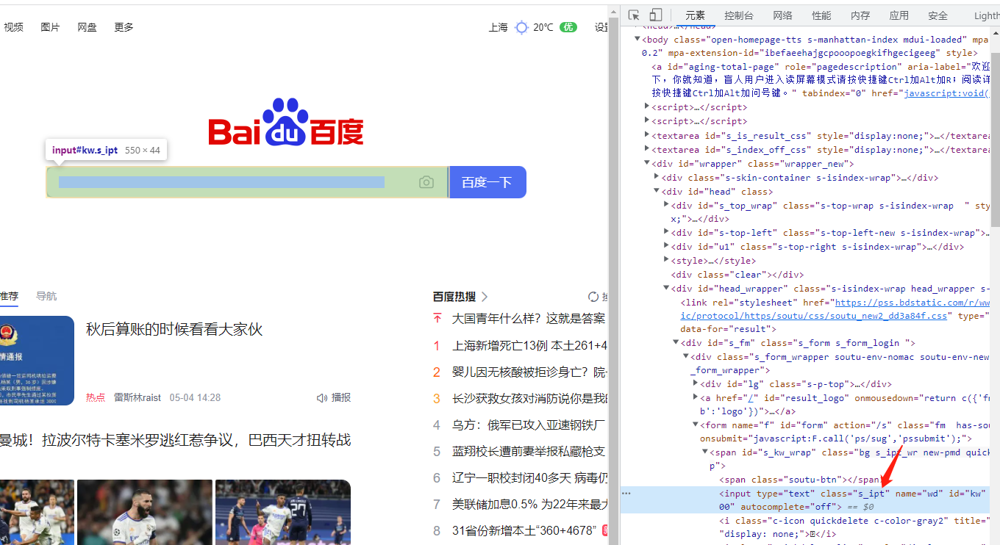
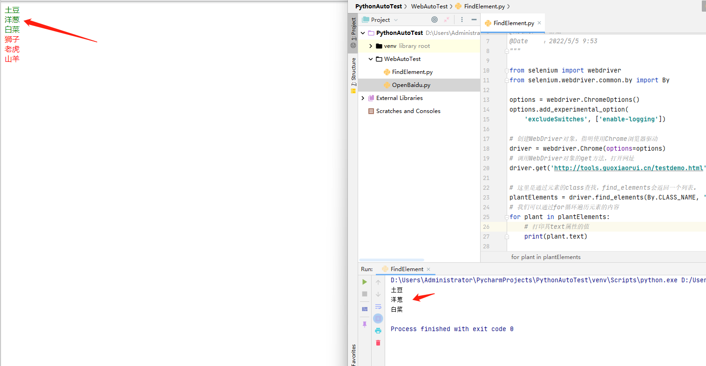
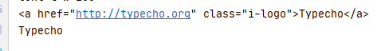
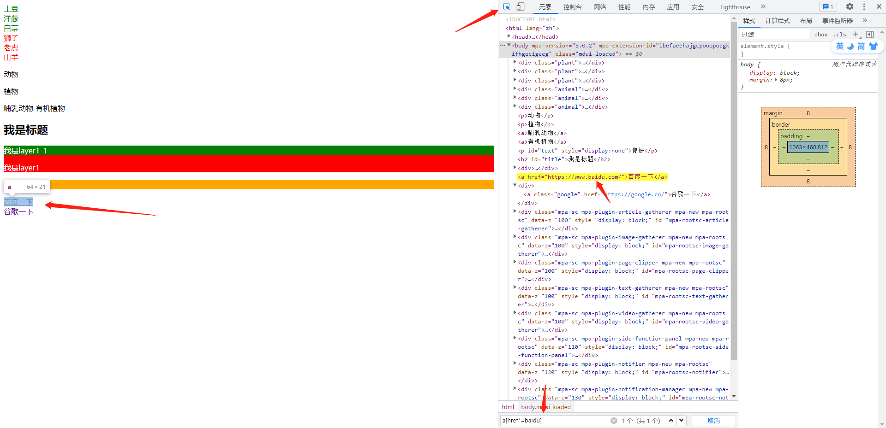
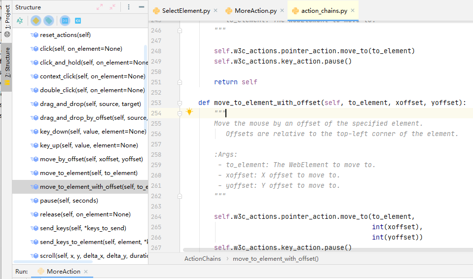

[源码见]('https://github.com/xiaorui16888/AutoTest_Note')

## 前言

Selenium 是一套 Web网站 的程序自动化操作 解决方案。

通过它，我们可以写出自动化程序，像人一样在浏览器里操作web界面。 比如点击界面按钮，在文本框中输入文字 等操作。

而且还能从web界面获取信息。 比如获取 火车、汽车票务信息，招聘网站职位信息，财经网站股票价格信息 等等，然后用程序进行分析处理。

## Selenium 的自动化原理

自动化程序（selenium客户端库）＜＞浏览器驱动（由浏览器厂商提供）＜＞浏览器（如Chrome、Firefox）

selenium 自动化流程如下：

1. 自动化程序调用Selenium 客户端库函数（比如点击按钮元素）
2. 客户端库会发送Selenium命令给浏览器的驱动程序
3. 浏览器驱动程序接收到命令后 ,驱动浏览器去执行命令
4. 浏览器执行命令
5. 浏览器驱动程序获取命令执行的结果，返回给我们自动化程序
6. 自动化程序对返回结果进行处理

## 环境安装

### 安装客户端库

我使用的是python，非常的适合敏捷开发，速度快。

使用pip安装

```shell
pip install selenium
```

网络问题，延迟非常高的话，可以指定镜像源

```shell
pip install selenium -i https://pypi.douban.com/simple/
```

### 安装浏览器驱动

不同浏览器的驱动都不一样，因为Chrome浏览器对于selenium自动化支持更加成熟一些，工作中一般也都是使用Chrome浏览器。

Chrome驱动下载地址：

https://chromedriver.storage.googleapis.com/index.html

根据你Chrome浏览器的版本号去下载对应的版本驱动。

我是在windows平台下开发的，就下载chromedriver_win32.zip。下载解压后，放到项目目录下，或者任意目录下。

以上操作，环境就搭建完毕了。

## 简单示例

代码描述：自动打开Chrome浏览器并打开百度。

```python
from selenium import webdriver
from selenium.webdriver.chrome.service import Service

# 创建WebDriver对象，指明使用Chrome浏览器驱动
driver = webdriver.Chrome(service=Service(r'C:\Program Files\Google\Chrome\Application\chromedriver.exe'))
# 调用WebDriver对象的get方法，打开网址
driver.get('https://www.baidu.com')
```

这里我可以通过WebDriver对象来操控浏览器，比如打开网址、点击页面元素等。

执行完自动化代码，如果想关闭浏览器窗口可以调用WebDriver对象的`quit`方法，像这样 `wd.quit()`。

## 省略浏览器驱动路径

在环境变量中配置chromedriver.exe的路径后

```python
webdriver.Chrome()
```

就可以很方便的打开浏览器，代码量也可以减少。

## 常见问题

### 关闭 chromedriver 日志

缺省情况下 chromedriver被启动后，会在屏幕上输出不少日志信息，如下

```
DevTools listening on ws://127.0.0.1:19727/devtools/browser/c19306ca-e512-4f5f-b9c7-f13aec506ab7
[21564:14044:0228/160456.334:ERROR:device_event_log_impl.cc(211)] [16:04:56.333] Bluetooth: bluetooth_adapter_winrt.cc:1072 Getting Default Adapter failed.
```

可以这样关闭

```python
options = webdriver.ChromeOptions()
options.add_experimental_option(
    'excludeSwitches', ['enable-logging'])

# 创建WebDriver对象，指明使用Chrome浏览器驱动
driver = webdriver.Chrome(options=options)
# 调用WebDriver对象的get方法，打开网址
driver.get('https://www.baidu.com')
```

### 浏览器首页显示防病毒重置设置

有的朋友的电脑上Selenium自动化时，浏览器开始显示如下



可以这样解决：

1. 命令行输入 `regedit` ，运行注册表编辑器
2. 在左边的目录树找到`HKEY_CURRENT_USER\Software\Google\Chrome`
3. 删除其下的 `TriggeredReset` 子项
4. 关闭 注册表编辑器

## 选择元素的基本方法

如：我们打开百度后，需要在输入框内键入`python`，那么需要怎么操作呢？

流程：先找到元素，然后再操作元素。

跟如果把大象放进冰箱一个道理，哈哈~

### 选择元素的方法

对于web网页的话，需要用F12或者右键-检查元素，来寻找对应元素，然后观察其特征。



或者



点击开发者工具--最左边的图标，这样鼠标放置到网页上的元素后，代码会自动高亮显示。

### 根据id属性选择元素

正常情况下，按照规范，元素的id是当前html中唯一的。但是不排除有不正常情况。

如果元素id唯一，那么通过id来选择元素是最简单高效的方式。



如上图，这里百度网页输入框元素的id值就为`kw`。

下面代码，打开百度，搜索python。

```python
from selenium import webdriver
from selenium.webdriver.common.by import By

options = webdriver.ChromeOptions()
options.add_experimental_option(
    'excludeSwitches', ['enable-logging'])

# 创建WebDriver对象，指明使用Chrome浏览器驱动
driver = webdriver.Chrome(options=options)
# 调用WebDriver对象的get方法，打开网址
driver.get('https://www.baidu.com')

# 根据id选择元素，返回的就是该元素对应的WebElement对象
input_element = driver.find_element(By.ID, 'kw')
# 键入python字符串到输入框里
input_element.send_keys('python')
```

这里有必要说明一下！！！

不建议使用find_element_by*方法，因为这种方法，不利用我们后期框架的封装。

### 根据class属性、tag名选择元素

如果你对html网页不熟悉的话，还是建议学习一下html基础知识。

因为有时候元素并没有id，你不能一棵树上吊死，哈哈

`class`属性，好比就是元素的装饰器。

比如以下html代码

```html
<body>
    <div class="plant"><span>土豆</span></div>
    <div class="plant"><span>洋葱</span></div>
    <div class="plant"><span>白菜</span></div>
    <div class="animal"><span>狮子</span></div>
    <div class="animal"><span>老虎</span></div>
    <div class="animal"><span>山羊</span></div></body>
```

所有的植物元素的class值为plant，动物元素的class值为animal

如果我们要选择所有的植物，代码如下。

```python
from selenium import webdriver
from selenium.webdriver.common.by import By

options = webdriver.ChromeOptions()
options.add_experimental_option(
    'excludeSwitches', ['enable-logging'])

# 创建WebDriver对象，指明使用Chrome浏览器驱动
driver = webdriver.Chrome(options=options)
# 调用WebDriver对象的get方法，打开网址
driver.get('http://tools.guoxiaorui.cn/testdemo.html')

# 这里是通过元素的class查找，find_elements会返回一个列表。
plantElements = driver.find_elements(By.CLASS_NAME, 'plant')
# 我们可以通过for循环遍历元素的内容
for plant in plantElements:
    # 打印其text属性的值
    print(plant.text)

```


效果如下：



这里如果使用`find_element`方法，则只会返回一个element对象，而不是列表。

特别注意：html元素不一定只有一个class，还可能有多个，如：

```html
<p class="people boy">小郭</p>
```

你是不是很聪明的以为，如果通过class去查找元素的话，可以这么写？

```python
driver.find_element(By.CLASS_NAME,'people boy')
```

那你就大错特错了！这是一种错误的写法！！！

我们只能指定任意一个class属性值，而不是多个！

### 通过tag名选择元素

通过指定参数为 `By.TAG_NAME` ，选择所有的tag名为p的元素，代码如下：

```python
from selenium import webdriver
from selenium.webdriver.common.by import By

options = webdriver.ChromeOptions()
options.add_experimental_option(
    'excludeSwitches', ['enable-logging'])

# 创建WebDriver对象，指明使用Chrome浏览器驱动
driver = webdriver.Chrome(options=options)
# 调用WebDriver对象的get方法，打开网址
driver.get('http://tools.guoxiaorui.cn/testdemo.html')
# 通过TAG_NAME查询元素
pElements = driver.find_elements(By.TAG_NAME, 'p')
for p in pElements:
    print(p.text)
```

### find_element 和 find_elements 的区别

使用 `find_elements` 选择的是符合条件的 `所有` 元素， 如果没有符合条件的元素， `返回空列表`

使用 `find_element` 选择的是符合条件的 `第一个` 元素， 如果没有符合条件的元素， `抛出 NoSuchElementException 异常`

### 通过WebElement对象选择元素

不仅 WebDriver对象有选择元素的方法， WebElement对象也有选择元素的方法。

WebElement对象也可以调用 `find_elements`， `find_element` 之类的方法。

WebDriver对象选择元素的范围是`整个web页面`，而WebElement 对象`选择元素的范围是该元素的内部`。

```python
from selenium import webdriver
from selenium.webdriver.common.by import By

options = webdriver.ChromeOptions()
options.add_experimental_option(
    'excludeSwitches', ['enable-logging'])

# 创建WebDriver对象，指明使用Chrome浏览器驱动
driver = webdriver.Chrome(options=options)
# 调用WebDriver对象的get方法，打开网址
driver.get('http://tools.guoxiaorui.cn/testdemo.html')
# 通过WebElement对象选择元素
bodyElement = driver.find_element(By.TAG_NAME, 'body')
spanElements = bodyElement.find_elements(By.TAG_NAME, 'a')
for span in spanElements:
    print(span.text)
```

### 等待界面元素出现

在我们进行网页操作的时候， 有的元素内容不是可以立即出现的， 可能会等待一段时间。

大聪明的你，是不是想到了`time.sleep()`

但是你想一下，如果你设置的休眠时间为10秒，但是元素在5秒的时候就加载出来了。完全不需要等待10秒的时候，这样就造成了时间的浪费。

这里聪明的selenium提供了一个更合理的解决方案：

> 当发现元素没有找到的时候，**并不立即返回**找不到元素的error，而是周期性（每隔半秒钟）重新寻找该元素，直到找到为止。或者超出指定最大等待时长，这时候才会抛出异常（如果是`find_elements` 之类的方法， 则是返回空列表）。

Selenium的Webdriver 对象有个方法叫 `implicitly_wait` ，可以称之为 `隐式等待` ，或者 `全局等待` 。

该方法接受一个参数，用来指定最大等待时长。

代码如下：

```python
# 创建WebDriver对象，指明使用Chrome浏览器驱动
driver = webdriver.Chrome(options=options)
# 隐式等待
driver.implicitly_wait(10)
```

那么后续所有的`find_element` 或者 `find_elements` 之类的方法调用都会采用上面的策略。

那么是不是用了`implicitly_wait`，可以彻底不用`sleep`了？

不不不！比如多级选择器（如省市区），选择之后，页面有一个反应过程，所以还是需要使用`sleep`的。

## 操控元素的基本方法

选择到元素之后，我们的代码会返回元素对应的 WebElement对象，通过这个对象，我们就可以 `操控` 元素了。

操控元素通常有：

1. 点击元素
2. 在元素中输入字符串，通常是对输入框这样的元素
3. 获取元素包含的信息，比如文本内容，元素的属性

### 点击元素

调用元素WebElement对象的`click`方法。

### 输入框

调用元素WebElement对象的`send_keys`方法。

如果输入框内已经有内容，可以使用WebElement对象的`clear`方法。

```python
# 键入账号
accountInput = driver.find_element(By.ID, 'name')
# 我们假装需要清空输入框
accountInput.clear()
# 输入新字符串
accountInput.send_keys('admin')
```

### 获取元素信息

#### 获取元素的文本内容

通过WebElement对象的 `text` 属性，可以获取元素 `展示在界面上的` 文本内容。

```python
logoElement = driver.find_element(By.CLASS_NAME, 'i-logo')
print(logoElement.text)
```

#### 获取元素属性

通过WebElement对象的 `get_attribute` 方法来获取元素的属性值。

```python
print(accountInput.get_attribute('class'))
```

#### 获取整个元素对应的HTML

要获取整个元素对应的HTML文本内容，可以使用 `element.get_attribute('outerHTML')`

如果，只是想获取某个元素 `内部` 的HTML文本内容，可以使用 `element.get_attribute('innerHTML')`

```python
# 获取元素对应的html文本内容
print(logoElement.get_attribute('outerHTML'))
# 获取元素内部的html文本内容
print(logoElement.get_attribute('innerHTML'))
```

效果如下：



#### 获取输入框里面的文字

对于input输入框的元素，要获取里面的输入文本，用text属性是不行的，这时可以使用 `element.get_attribute('value')`

```python
# 获取输入框里面的文字
print(accountInput.get_attribute('value'))
```

#### 获取元素文本内容2

通过WebElement对象的 `text` 属性，可以获取元素 `展示在界面上的` 文本内容。

但是，有时候，元素的文本内容没有展示在界面上，或者没有完全完全展示在界面上。 这时，**用WebElement对象的text属性，获取文本内容，就会有问题**。

出现这种情况，可以尝试使用 `element.get_attribute('innerText')` ，或者 `element.get_attribute('textContent')`

使用 innerText 和 textContent 的区别是，前者只显示元素可见文本内容，后者显示所有内容（包括display属性为none的部分）

具体点说：innerText只有HTML元素才可以调用，但是textContent任意Node节点都可以。

```html
<p id="text" style="display:none">你好</p>
```

```python
# 获取输入框里面的文字
inputElement = driver.find_element(By.ID, 'text')
print(inputElement.text)
print(inputElement.get_attribute('innerText'))
print(inputElement.get_attribute('textContent'))
```

## Css表达式

如果你需要选择的元素，没有id，也没有class属性，或者有些不想选择的元素有相同的id和class属性值。就需要用到Css selector语法来选择元素。

### 根据 tag名、id、class 选择元素

```python
spans=driver.find_elements(By.CSS_SELECTOR,'span')
for span in spans:
    print(span.text)
```

通过tag去选择元素，其实写法类似于`find_elements(By.TAG_NAME,'span')`

根据id属性 选择元素的语法是在id号前面加上一个井号： `#id值`

```python
title=driver.find_element(By.CSS_SELECTOR,'#title')
print(title.text)
```

根据class属性 选择元素的语法是在 class 值 前面加上一个点： `.class值`

```python
animals=driver.find_elements(By.CSS_SELECTOR,'.animal')
for animal in animals:
    print(animal.text)
```

### 选择子元素和后代元素

子元素选择，相当于父元素 > 子元素 > 子子元素

```python
childElement1 = driver.find_element(By.CSS_SELECTOR, 'div > #layer1 > #layer1_1')
print(childElement1.text)
```

也可以这样写

```python
childElement2 = driver.find_element(By.CSS_SELECTOR, 'div > #layer1_1')
print(childElement2.text)
```

这里`#layer1_1`的父元素不是`div`，它属于`div`的后代元素。

这里写法，支持多层次，可跨级。具体情况，具体分析。

### 根据属性选择

id、class 都是web元素的 `属性` ，因为它们是很常用的属性，所以css选择器专门提供了根据 id、class 选择的语法。

那么如果通过a标签的href去进行选择，当然也可以通过css选择器。

css选择器支持任何属性来选择元素，还可以配合正则表达式来用。

语法：[]

比如：

```html
<a href="https://www.baidu.com/">百度一下</a>
```

```python
aElement = driver.find_element(By.CSS_SELECTOR, '[href="https://www.baidu.com/"]')
print(aElement.get_attribute('outerHTML'))
```

CSS 还可以选择 属性值 `包含` 某个字符串 的元素。

```python
aElementContainBaidu = driver.find_element(By.CSS_SELECTOR, '[href*="baidu"]')
print(aElementContainBaidu.get_attribute('outerHTML'))
```

还可以 选择 属性值 以某个字符串 `开头` 的元素。

```python
aElementStartWithHttp = driver.find_element(By.CSS_SELECTOR, '[href^="http"]')
print(aElementStartWithHttp.get_attribute('outerHTML'))
```

还可以 选择 属性值 以某个字符串 `结尾` 的元素。

```python
aElementEndWithCOM = driver.find_element(By.CSS_SELECTOR, '[href$="com/"]')
print(aElementEndWithCOM.get_attribute('outerHTML'))
```

如果一个元素具有多个属性

```html
<a class="google" href="https://google.cn/">谷歌一下</a>
```

```python
aElementContainGoogle = driver.find_element(By.CSS_SELECTOR,
                                            'a[href*="google"][class="google"]')
print(aElementContainGoogle.get_attribute('outerHTML'))
```

### 验证 CSS Selector



可以借助Chrome浏览器的开发者工具，去验证。

如果验证成功，选择的元素会高亮显示。无需再用代码挨个去验证，可降低代码量。

### 选择语法联合使用

CSS selector的另一个强大之处在于： 选择语法 可以 `联合使用`。

如：

```html
<div class='footer1'>
    <span class='copyright'>版权</span>
    <span class='date'>rui...</span>
</div>
```

CSS selector 表达式 可以这样写：

```
div.footer1 > span.copyright
```

也可以这样写

```
.footer1 > .copyright
```

也可以这样写

```
.footer1  .copyright
```

### 组选择

如果我们要 同时选择所有class 为 plant `和` class 为 animal 的元素。

可以这样写

```
.plant , .animal
```

再比如，我们要同时选择所有tag名为div的元素 `和` id为text的元素，就可以像这样写

```
div,#text
```

那如果要选择id为group1里面的span和p元素，是不是应该这样写

```
#group1 > span,p
```

大错特错！！！这样写的意思是 选择所有 `id为group1里面的 span` 和 `所有的p元素`

只能这样写

```
#t1 > span , #t1 > p
```

> 组选择结果列表中，选中元素排序， 不是 组表达式的次序， 而是符合这些表达式的元素，在HTML文档中的出现的次序。

### 按次序选择子节点

```html
 <body>  
       <div id='t1'>
           <h3> 唐诗 </h3>
           <span>李白</span>
           <p>静夜思</p>
           <span>杜甫</span>
           <p>春夜喜雨</p>              
       </div>      
        
       <div id='t2'>
           <h3> 宋词 </h3>
           <span>苏轼</span>
           <p>赤壁怀古</p>
           <p>明月几时有</p>
           <p>江城子·乙卯正月二十日夜记梦</p>
           <p>蝶恋花·春景</p>
           <span>辛弃疾</span>
           <p>京口北固亭怀古</p>
           <p>青玉案·元夕</p>
           <p>西江月·夜行黄沙道中</p>
       </div>             
</body>
```

#### 父元素的第n个子节点

使用`nth-child`

如我们选择唐诗和宋词的作者，也就是说 选择的是 第2个子元素，并且是span类型，所以这样可以这样写 `span:nth-child(2)` 、

如果你不加节点类型限制，直接这样写 `:nth-child(2)`，就是选择所有位置为第2个的所有元素，不管是什么类型。

#### 父元素的倒数第n个子节点

使用`nth-last-child`

```
p:nth-last-child(1)
```

就是选择第倒数第1个子元素，并且是p元素。

#### 父元素的第几个某类型的子节点

我们可以指定选择的元素 是父元素的第几个 `某类型的` 子节点

使用 `nth-of-type`

比如，我们要选择 唐诗 和宋词 的第一个 作者，可以像上面那样思考：选择的是 第2个子元素，并且是span类型，所以这样可以这样写 `span:nth-child(2)` 。

还可以这样思考，选择的是 `第1个span类型` 的子元素，所以也可以这样写 `span:nth-of-type(1)`

#### 父元素的倒数第几个某类型的子节点

当然也可以反过来， 选择父元素的 `倒数第几个某类型` 的子节点

使用 `nth-last-of-type`

```
p:nth-last-of-type(2)
```

#### 奇数节点和偶数节点

如果要选择的是父元素的 `偶数节点`，使用 `nth-child(even)`

```
p:nth-child(even)
```

如果要选择的是父元素的 `奇数节点`，使用 `nth-child(odd)`

```
p:nth-child(odd)
```

如果要选择的是父元素的 `某类型偶数节点`，使用 `nth-of-type(even)`

如果要选择的是父元素的 `某类型奇数节点`，使用 `nth-of-type(odd)`

### 兄弟节点选择

#### 相邻兄弟节点选择

上面的例子里面，我们要选择 唐诗 和宋词 的第一个 作者

还有一种思考方法，就是选择 h3 `后面紧跟着的兄弟节点` span。

这就是一种 相邻兄弟 关系，可以这样写 `h3 + span`

表示元素 紧跟关系的 是 `加号`

#### 后续所有兄弟节点选择

如果要选择是 选择 h3 `后面所有的兄弟节点` span，可以这样写 `h3 ~ span`

## frame切换/窗口切换

### 切换到frame

```python
from selenium import webdriver
from selenium.webdriver.common.by import By

options = webdriver.ChromeOptions()
options.add_experimental_option(
    'excludeSwitches', ['enable-logging'])

# 创建WebDriver对象，指明使用Chrome浏览器驱动
driver = webdriver.Chrome(options=options)
# 隐式等待
driver.implicitly_wait(10)
# 调用WebDriver对象的get方法，打开网址
driver.get('http://tools.guoxiaorui.cn/testdemo2.html')

# 先切换到需要操作元素所属的frame元素内---属性name值或id值
driver.switch_to.frame('frame1')

# 也可以填写frame 所对应的 WebElement 对象，不过这种写法过于麻烦了~
# driver.switch_to.frame(driver.find_element(By.TAG_NAME, 'iframe'))

plantElements = driver.find_elements(By.CLASS_NAME, 'plant')
for plant in plantElements:
    print(plant.text)

# 切换到原来的主html
driver.switch_to.default_content()
driver.find_element(By.ID, 'outerbutton').click()
```

### 切换到新窗口

在网页上操作的时候，我们经常遇到，点击一个链接 或者 按钮，就会打开一个 `新窗口` 。

问题就在于，即使新窗口打开了， 这时候，我们的 WebDriver对象对应的 还是老窗口，自动化操作也还是在老窗口进行。

如果我们要到新的窗口里面操作，可以使用Webdriver对象的switch_to属性的 window方法。

```python
driver.switch_to.window(handle)
```

WebDriver对象有window_handles 属性，这是一个列表对象， 里面包括了当前浏览器里面**所有的窗口句柄**。所谓句柄，可以想象成对应网页窗口的一个ID。

```python
for handle in wd.window_handles:
    # 先切换到该窗口
    wd.switch_to.window(handle)
    # 得到该窗口的标题栏字符串，判断是不是我们要操作的那个窗口
    if '必应' in wd.title:
        # 如果是，那么这时候WebDriver对象就是对应的该该窗口，正好，跳出循环，
        break
```

同样的，如果我们在新窗口 操作结束后， 还要回到原来的窗口。

我们可以在切换窗口之前，就保存老窗口的句柄，

```python
# mainWindow变量保存当前窗口的句柄
mainWindow = wd.current_window_handle
```

切换到新窗口操作完后，就可以直接像下面这样，将driver对应的对象返回到原来的窗口

```python
#通过前面保存的老窗口的句柄，自己切换到老窗口
wd.switch_to.window(mainWindow)
```

## 选择框

常见选择框：radio框，checkbox框，select框

### radio框

```python
from selenium import webdriver
from selenium.webdriver.common.by import By

options = webdriver.ChromeOptions()
options.add_experimental_option(
    'excludeSwitches', ['enable-logging'])

# 创建WebDriver对象，指明使用Chrome浏览器驱动
driver = webdriver.Chrome(options=options)
# 隐式等待
driver.implicitly_wait(10)
# 调用WebDriver对象的get方法，打开网址
driver.get('http://tools.guoxiaorui.cn/testdemo4.html')

# 获取当前选中的元素
checkedElement = driver.find_element(By.CSS_SELECTOR, '#s_radio input[checked=checked]')
print('当前选中：' + checkedElement.get_attribute('value'))

# 点击选中小江老师
driver.find_element(By.CSS_SELECTOR, '#s_radio input[value="小江老师"]').click()
```

### checkbox框

```python
# 点击选中的选项
checkedElements = driver.find_elements(By.CSS_SELECTOR, '#s_checkbox input[checked=checked]')

for element in checkedElements:
    element.click()

driver.find_element(By.CSS_SELECTOR, '#s_checkbox input[value="小江老师"]').click()
```

### select框

radio框及checkbox框都是input元素，只是里面的type不同而已。

select框 则是一个新的select标签。

对于Select 选择框， Selenium 专门提供了一个 `Select类` 进行操作。

Select类 提供了如下的方法：

`select_by_value` 根据选项的value属性值选择元素

`select_by_index` 根据选项的次序（从1开始）选择元素

`select_by_visible_text` 根据选项的可见文本选择元素

`deselect_by_value` 根据选项的value属性值**去除**选中元素

`deselect_by_index` 根据选项的次序**去除**选中元素

`deselect_by_visible_text` 根据选项的可见文本**去除**选中元素

`deselect_all` 去除选中所有元素

##### Select单选框

```python
# 创建select对象
singleSelect = Select(driver.find_element(By.ID, 'ss_single'))
# 通过select对象选中小江老师
singleSelect.select_by_visible_text('小江老师')
```

##### Select多选框

对于select多选框，要选中某几个选项，要注意去掉原来已经选中的选项。

```python
# 创建select对象
multipleSelect = Select(driver.find_element(By.ID, 'ss_multi'))
# 清除所以 已经选中的 选项
multipleSelect.deselect_all()
# 选中需要选择的
multipleSelect.select_by_visible_text('小江老师')
multipleSelect.select_by_visible_text('小雷老师')
```

## 实战常用技巧

对于元素的选择、输入，已经是没什么问题了。

那么对于鼠标的右键点击、双击、移动鼠标到某个元素上、鼠标的拖拽等操作。该如何实现？可以使用selenium提供的`ActionChains`类来实现。

### 更多动作


```python
# 创建WebDriver对象，指明使用Chrome浏览器驱动
driver = webdriver.Chrome(options=options)
# 隐式等待
driver.implicitly_wait(10)
# 调用WebDriver对象的get方法，打开网址
driver.get('https://www.baidu.com')

action = ActionChains(driver)
# 鼠标移动到 元素上
action.move_to_element(driver.find_element(By.CSS_SELECTOR, '[name="tj_briicon"]')).perform()
```

其他`ActionChains`类提高的方法如下：



### 直接执行javascript

```python
# 直接执行 javascript，里面可以直接用return返回我们需要的数据
nextPageButtonDisabled = driver.execute_script(
    '''
    ele = document.querySelector('.soupager > button:last-of-type');
    return ele.getAttribute('disabled')
    ''')

# 返回的数据转化为Python中的数据对象进行后续处理
if nextPageButtonDisabled == 'disabled': # 是最后一页
    return True
else: # 不是最后一页
    return False
```

### 页面冻结

```js
setTimeout(function(){debugger}, 5000)
```

表示在 5000毫秒后，执行 debugger 命令

执行该命令会 浏览器会进入debug状态。 debug状态有个特性， 界面被冻住， 不管我们怎么点击界面都不会触发事件。

### 弹出对话框

弹出的对话框有三种类型，分别是 Alert（警告信息）、confirm（确认信息）和prompt（提示输入）

#### Alert

```python
# 创建WebDriver对象，指明使用Chrome浏览器驱动
driver = webdriver.Chrome(options=options)
# 隐式等待
driver.implicitly_wait(10)
# 调用WebDriver对象的get方法，打开网址
driver.get('http://tools.guoxiaorui.cn/dialog.html')

# alert
driver.find_element(By.ID, 'b1').click()
# 打印 弹出框 提示信息
print(driver.switch_to.alert.text)
# 点击ok按钮
driver.switch_to.alert.accept()
```

#### Confirm

```python
# confirm
driver.find_element(By.ID, 'b2').click()
# 打印 弹出框 提示信息
print(driver.switch_to.alert.text)
# 点击ok按钮
driver.switch_to.alert.accept()
# confirm
driver.find_element(By.ID, 'b2').click()
# 打印 弹出框 提示信息
print(driver.switch_to.alert.text)
# 点击cancel按钮
driver.switch_to.alert.dismiss()
```

#### Prompt

```python
# Prompt
driver.find_element(By.ID, 'b3').click()
alert = driver.switch_to.alert
# 打印 弹出框 提示信息
print(alert.text)
# 输入信息
alert.send_keys('不是')
# 点击cancel按钮
alert.accept()

time.sleep(3)
driver.find_element(By.ID, 'b3').click()
alert = driver.switch_to.alert
alert.dismiss()
```

### 其他技巧

#### 窗口大小

`driver.get_window_size()` 获取窗口大小

`driver.set_window_size(x, y)` 改变窗口大小

#### 获取当前窗口标题

```python
driver.title
```

#### 获取当前窗口URL地址

```
driver.current_url
```

#### 截屏

有的时候，我们需要把浏览器屏幕内容保存为图片文件。

比如，做自动化测试时，一个测试用例检查点发现错误，我们可以截屏为文件，以便测试结束时进行人工核查。

可以使用 WebDriver 的 get_screenshot_as_file方法来截屏并保存为图片。

```python
# 截屏保存为图片文件
driver.get_screenshot_as_file('error.png')
```

#### 手机模式

我们可以通过 `desired_capabilities` 参数，指定以手机模式打开chrome浏览器

```python
from selenium import webdriver
from selenium.webdriver.chrome.options import Options  # 手机模式

# 设置手机型号，这设置为iPhone 6
mobile_emulation = {"deviceName": "iPhone 6"}

options = Options()
options.add_experimental_option("mobileEmulation", mobile_emulation)

# 启动配置好的浏览器
driver = webdriver.Chrome(options=options)

# 输入网址
driver.get('http://m.baidu.com')
```

#### 上传文件

通常，网站页面上传文件的功能，是通过 `type` 属性 为 `file` 的 HTML `input` 元素实现的。

```html
<input type="file" multiple="multiple">
```

使用selenium自动化上传文件，我们只需要定位到该input元素，然后通过 send_keys 方法传入要上传的文件路径即可。

```python
# 创建WebDriver对象，指明使用Chrome浏览器驱动
driver = webdriver.Chrome(options=options)
# 隐式等待
driver.implicitly_wait(10)

# 调用WebDriver对象的get方法，打开网址
driver.get('https://tinypng.com/')

# 先定位到上传文件的元素
uploadElement = driver.find_element(By.CSS_SELECTOR, 'input[type="file"]')
# 添加文件
uploadElement.send_keys(r'C:\Users\Administrator\Desktop\logo.png')
```

如果input支持多个文件上传，可以多次调用`send_keys`

但是，有的网页上传，是没有 file 类型 的 input 元素的。

如果是Windows上的自动化，可以采用 Windows 平台专用的方法：

```
pip install pywin32
```

参考如下：

```python
# 找到点击上传的元素，点击
driver.find_element(By.CSS_SELECTOR, '.dropzone').click()

sleep(2) # 等待上传选择文件对话框打开

# 直接发送键盘消息给 当前应用程序，
# 前提是浏览器必须是当前应用
import win32com.client
shell = win32com.client.Dispatch("WScript.Shell")

# 输入文件路径，最后的'\n'，表示回车确定，也可能时 '\r' 或者 '\r\n'
shell.Sendkeys(r"h:\a2.png" + '\n')
sleep(1)
```

### 自动化Edge浏览器

```python
from selenium import webdriver

driver = webdriver.Edge(r'd:\tools\webdrivers\msedgedriver.exe')

driver.get('http://www.51job.com')
```

### 自动化Electron程序

Electron程序都是基于基于Chromium技术开发的，所以基本也可以用Chromedriver驱动自动化。

要自动化，首先需要得到内置 Chromium的版本号。

向开发人员查询打开 Dev Tools 窗口的快捷键（通常是ctrl + Shift + I），打开Dev Tools 窗口后， 在 Console tab中输入 如下语句，查看版本。

```python
from selenium import webdriver

# 指定Electron程序路径
ops.binary_location = r"C:\electronAPP.exe"

driver = webdriver.Chrome()
```

## Xpath选择器

还有一种 灵活、强大 的选择元素的方式，就是使用 `Xpath` 表达式。

> 既然已经有了CSS，为什么还要学习 Xpath呢？ 因为
>
> - 有些场景 用 css 选择web 元素 很麻烦，而xpath 却比较方便。
> - 另外 Xpath 还有其他领域会使用到，比如 爬虫框架 Scrapy， 手机App框架 Appium。

### Xpath语法简介

##### 绝对路径选择

从根节点开始的，到某个节点，每层都依次写下来，每层之间用 `/` 分隔的表达式，就是某元素的 `绝对路径`

上面的xpath表达式 `/html/body/div` ，就是一个绝对路径的xpath表达式， 等价于 css表达式 `html>body>div`

```python
elements = driver.find_elements(By.XPATH, "/html/body/div")
```

##### 相对路径选择

‘//’ 符号也可以继续加在后面,比如，要选择 所有的 div 元素里面的 所有的 p 元素 ，不管div 在什么位置，也不管p元素在div下面的什么位置，则可以这样写 `//div//p`

```python
elements = driver.find_elements(By.XPATH, "//div//p")
```

或者

```python
elements = driver.find_elements(By.CSS_SELECTOR,"div p")
```

如果，要选择 所有的 div 元素里面的 直接子节点 p ， xpath，就应该这样写了 `//div/p`

如果使用CSS选择器，则为 `div > p`

##### 通配符

如果要选择所有div节点的所有直接子节点，可以使用表达式 //div/*

*是一个通配符，对应任意节点名的元素，等价于CSS选择器 div > *

```python
elements = driver.find_elements(By.XPATH, "//div/*")
for element in elements:
    print(element.get_attribute('outerHTML'))
```

### 根据属性选择

Xpath 可以根据属性来选择元素。

根据属性来选择元素 是通过 这种格式来的 `[@属性名='属性值']`

注意：

- 属性名注意前面有个@
- 属性值一定要用引号， 可以是单引号，也可以是双引号

#### 根据id属性选择

选择 id 为 west 的元素，可以这样 `//*[@id='west']`

#### 根据class属性选择

选择所有 select 元素中 class为 single_choice 的元素，可以这样 `//select[@class='single_choice']`

如果一个元素class 有多个，比如

```html
<p id="beijing" class='capital huge-city'>
    北京    
</p>
```

如果要选 它， 对应的 xpath 就应该是 `//p[@class="capital huge-city"]`

不能只写一个属性，像这样 `//p[@class="capital"]` 则不行！！！

#### 根据其他属性

同样的道理，我们也可以利用其它的属性选择

比如选择 具有multiple属性的所有页面元素 ，可以这样 `//*[@multiple]`

#### 属性值包含字符串

要选择 style属性值 包含 color 字符串的 页面元素 ，可以这样 `//*[contains(@style,'color')]`

要选择 style属性值 以 color 字符串 `开头` 的 页面元素 ，可以这样 `//*[starts-with(@style,'color')]`

要选择 style属性值 以 某个 字符串 结尾 的 页面元素 ，大家可以推测是 `//*[ends-with(@style,'color')]`， 但是，很遗憾，这是xpath 2.0 的语法 ，目前浏览器都不支持

### 按次序选择

css表达式可以根据元素在父节点中的次序选择， 非常实用。

xpath也可以根据次序选择元素。 语法比css更简洁，直接在方括号中使用数字表示次序

比如

#### 某类型 第几个 子元素

选择 p类型第2个的子元素，就是

```
//p[2]
```

注意，选择的是 `p类型第2个的子元素` ， 不是 `第2个子元素，并且是p类型` 。

注意体会区别！！！和css表达式的区别

要选取父元素为div 中的 p类型 第2个 子元素

```
//div/p[2]
```

#### 第几个子元素

也可以选择第2个子元素，不管是什么类型，采用通配符

选择父元素为div的第2个子元素，不管是什么类型

```
//div/*[2]
```

#### 某类型 倒数第几个 子元素

当然也可以选取倒数第几个子元素

- 选取p类型倒数第1个子元素

```
//p[last()]
```

- 选取p类型倒数第2个子元素

```
//p[last()-1]
```

- 选择父元素为div中p类型倒数第3个子元素

```
//div/p[last()-2]
```

#### 范围选择

xpath还可以选择子元素的次序范围。

比如，

- 选取option类型第1到2个子元素

```py
//option[position()<=2]
```

或者

```py
//option[position()<3]
```

- 选择class属性为multi_choice的前3个子元素

```py
//*[@class='multi_choice']/*[position()<=3]
```

- 选择class属性为multi_choice的后3个子元素

```py
//*[@class='multi_choice']/*[position()>=last()-2]
```

为什么不是 `last()-3` 呢？ 因为

`last()` 本身代表最后一个元素

`last()-1` 本身代表倒数第2个元素

`last()-2` 本身代表倒数第3个元素

### 组选择、父节点、兄弟节点

#### 组选择

css有组选择，可以同时使用多个表达式，多个表达式选择的结果都是要选择的元素

css 组选择，表达式之间用 **逗号** 隔开

xpath也有组选择， 是用 **竖线** 隔开多个表达式

比如，要选所有的option元素 和所有的 h4 元素，可以使用

```
//option | //h4
```

等同于CSS选择器

```
option , h4
```

再比如，要选所有的 class 为 single_choice 和 class 为 multi_choice 的元素，可以使用

```
//*[@class='single_choice'] | //*[@class='multi_choice']
```

等同于CSS选择器

```
.single_choice , .multi_choice
```

#### 选择父节点

xpath可以选择父节点， 这是css做不到的。

某个元素的父节点用 `/..` 表示

比如，要选择 id 为 china 的节点的父节点，可以这样写 `//*[@id='china']/..` 。

当某个元素没有特征可以直接选择，但是它有子节点有特征， 就可以采用这种方法，先选择子节点，再指定父节点。

还可以继续找上层父节点，比如 `//*[@id='china']/../../../../..`

#### 兄弟节点选择

 css选择器，要选择某个节点的后续兄弟节点，用 **波浪线**

xpath也可以选择 后续 兄弟节点，用这样的语法 `following-sibling::`

比如，要选择 class 为 single_choice 的元素的所有后续兄弟节点 `//*[@class='single_choice']/following-sibling::*`

等同于CSS选择器 `.single_choice ~ *`

如果，要选择后续节点中的div节点， 就应该这样写 `//*[@class='single_choice']/following-sibling::div`

xpath还可以选择 `前面的` 兄弟节点，用这样的语法 `preceding-sibling::`

比如，要选择 class 为 single_choice 的元素的所有前面的兄弟节点 `//*[@class='single_choice']/preceding-sibling::*`

而CSS选择器目前还没有方法选择前面的 兄弟节点。

### selenium注意点

```python
# 先寻找id是china的元素
china = wd.find_element(By.ID, 'china')

# 再选择该元素内部的p元素
elements = china.find_elements(By.XPATH, '//p')

# 打印结果
for element in elements:
    print('----------------')
    print(element.get_attribute('outerHTML'))
```

运行发现，打印的 不仅仅是 china内部的p元素， 而是所有的p元素。

要在某个元素内部使用xpath选择元素， 需要 `在xpath表达式最前面加个点` 。

```python
elements = china.find_elements(By.XPATH, './/p')
```


