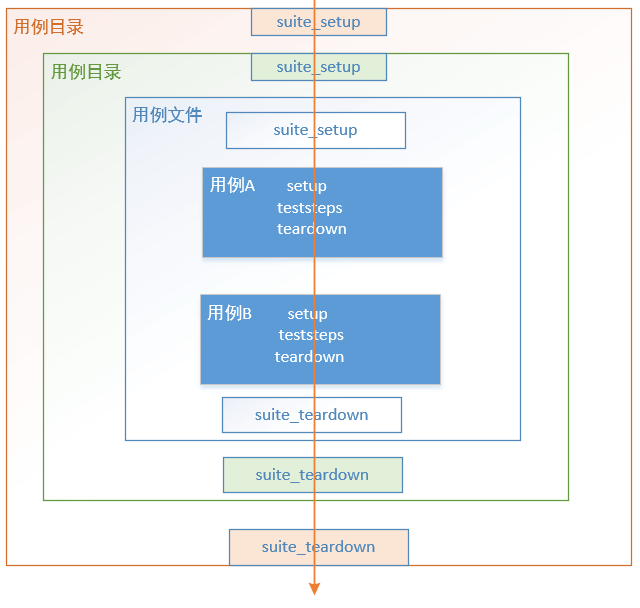
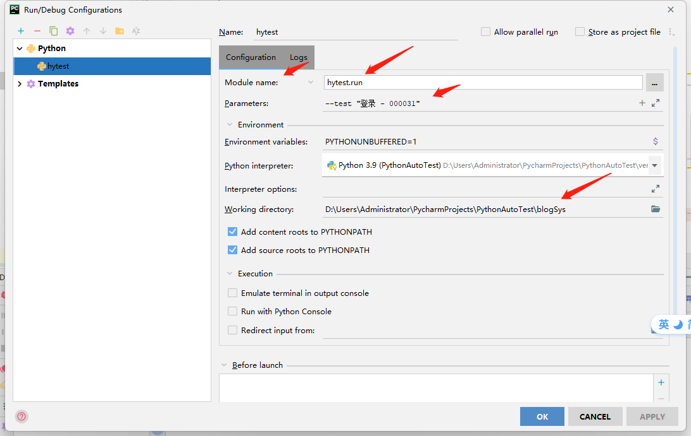

# hytest框架

[源码见]('https://github.com/xiaorui16888/AutoTest_Note')

## 前言

这个框架是我当时在学习自动化测试框架时候，见到的一个框架。顺便来记录一下。

> `hytest` （黑羽test）是白月黑羽自己研发的自动化测试框架，它非常适合 做 系统测试 自动化， 而相比之下，pytest、unittest 更适合白盒的单元测试、集成测试。
>
> 它有如下优点：
>
> - 上手非常简单
>
>   hytest 让大家直接用 Python 来写测试用例。
>
>   如果你有 Python编程经验，1小时就可以上手，1天就可以灵活使用。
>
> - 操作直观易懂
>
>   测试用例以 目录文件结构存放，清晰明了
>
>   `初始化清除` 机制清晰灵活
>
>   可以灵活地 **挑选** 要执行的测试用例
>
> - 漂亮的测试报告


## 安装、执行

```
pip install hytest
```

## 用例目录结构

cases` 目录下面的 每个目录 和 py 文件 都 被称之为 `测试套件(suite)

`测试套件` 是 `测试用例的集合` ， 通俗的说，就是 `一组用例` 。

为例方便管理，我们把功能相关的测试用例组合起来放在一起，成为某个测试套件。

- 包含 测试用例类 的 python 文件 称之为一个 `套件文件`
- 包含 套件文件的 目录 称之为 `测试套件目录`

## 用例类的定义

用例文件格式如下：

文件里面每个类对应一个用例。

- 类的 `name` 属性 指定 用例名

  如果没有name 属性，那么类名就会被当做是用例名称

- 类的 `teststeps` 方法 对应 测试步骤 代码

  测试步骤代码 就是自动化地 一步步执行测试用例 的程序。

  所以一个类 **必须要有 teststeps 方法**，才会被 hytest 当做是一个测试用例类。

  

## 单个用例

```python
class c0101:
    name = '管理员首页 - UI-0101'

    # 初始化方法
    def setup(self):
        open_browser()
        mgr_login()

    # 清除方法
    def teardown(self):
        wd = GSTORE['wd']
        wd.quit()

    # 测试用例步骤
    def teststeps(self):        
```

## 用例文件

这时，我们可以使用 `整个用例文件的初始化、清除`

就是在 文件中 添加全局函数 `suite_setup` 和 `suite_teardown`

```python
from hytest  import *
from lib.webui import  *
from time import sleep

def suite_setup():
    INFO('suite_setup')
    open_browser()
    mgr_login()

def suite_teardown():
    INFO('suite_teardown')
    wd = GSTORE['wd']
    wd.quit()

class c0101:
    # 测试用例名字
    name = '管理员首页 - UI-0101'

    def teststeps(self):
    # 此处省略 测试用例步骤代码    


class c0102:
    name = '管理员首页 - UI-0102'

    def teststeps(self):
    # 此处省略 测试用例步骤代码   
```

## 全局初始化（共同）

在这个目录下面创建名为 `__st__.py` 的文件。

和套件文件一样，套件目录的 的初始化、清除 也是在 文件中 添加全局函数 suite_setup、suite_teardown。

## 套件目录

如果 套件目录有 suite_setup、suite_teardown， 用例文件也有 suite_setup、suite_teardown ，用例里面也有 setup、teardown , 执行的顺序如下所示



## 缺省初始化、清除

`用例文件` 除了 可以使用 suite_setup、suite_teardown 对整个套件进行初始化清除，还支持另外一种初始化清除： `缺省初始化、清除`

就是定义 名称为 `test_setup` 和 `test_teardown` 的全局函数。

如果在 用例文件 中定义了 全局函数 `test_setup` ， 该文件中某个用例 `本身没有初始化` 方法， 执行自动化的时候就会 使用这个 test_setup 来初始化

如果在 用例文件 中定义了 全局函数 `test_teardown` ，该文件中某个用例 `本身没有清除` 方法， 执行自动化的时候就会 使用这个 test_teardown 来清除

## 数据驱动--data driven

```python
import sys
from time import sleep

sys.path.append('../')
from blogSys.lib.WebUI import *


# 数据驱动，多个用例
class c00003x:
    ddt_cases = [
        {
            'name': '登录 - 000031',
            'para': ['guoxiaorui', None, '请输入密码']
        },
        {
            'name': '登录 - 000032',
            'para': [None, None, '请输入用户名请输入密码']
        },
        {
            'name': '登录 - 000033',
            'para': [None, 'guoxiaorui', '请输入用户名']
        },
        {
            'name': '登录 - 000034',
            'para': ['guoxiaorui', '123456', '用户名或密码无效']
        },
        {
            'name': '登录 - 000035',
            'para': ['guoxiaorui', '17612917750.', '']
        }
    ]

    # 每个用例调用时，该用例的参数参数在 self.para 中
    def teststeps(self):
        wd = GSTORE['wd']
        wd.get('http://guoxiaorui.cn/admin')
        # 取出参数
        username, password, info = self.para
        INFO('{0}--{1}--{2}'.format(username, password, info))
        INFO('管理员登录')
        if username is not None:
            wd.find_element(By.ID, 'name').send_keys(username)
        if password is not None:
            wd.find_element(By.ID, 'password').send_keys(password)

        wd.find_element(By.CSS_SELECTOR, 'button[type="submit"]').click()
        sleep(2)
        popups = wd.find_elements(By.CSS_SELECTOR, 'div[class^="message popup"]')
        if len(popups) > 0:
            CHECK_POINT('弹出提示', info == popups[0].text)
        else:
            CHECK_POINT('弹出提示', info == '')

    def teardown(self):
        wd = GSTORE['wd']
        name_inputs = wd.find_elements(By.ID, 'name')
        password_inputs = wd.find_elements(By.ID, 'password')
        if len(name_inputs) > 0:
            name_inputs[0].clear()
        if len(password_inputs) > 0:
            password_inputs[0].clear()
```

hytest 的运行分为两个阶段

- 收集测试用例

  这个阶段会搜集所有的用例目录下面的代码中的用例类，

  把这些类实例化， 从而创建 `用例实例对象`

- 执行测试用例

  依次执行 上一步中创建的 `用例实例对象`

所以第一步中创建用例实例对象，是在执行测验实例 **之前** 的。

### 动态产生驱动数据

```python
class c0008x:
    ddt_cases = []
    for i in range(10):
        ddt_cases.append({
            'name': f'登录 UI_000{i + 1}',
            'para': [i + 1]
        })

    def teststeps(self):
        word = self.para
        print(word)
```

这里我直接mock的数据，一般来说，我们都是从excel、txt、数据库中获取模拟数据。

## 挑选用例执行 - 名称方式

执行自动化测试的时候，我们往往并不需要执行 `全部的` 测试用例。

比如：冒烟测试，只需要测试冒烟测试的那些用例。 或者调试自己写的某个用例的自动化，就只需要执行那一个用例。

hytest 可以灵活的挑选要执行的测试用例。

我们可以通过 `--test` 或者 `--suite` 命令行参数 来指定执行哪些用例或者套件，而且还支持用通配符的方式。

```
--test testA                # 执行名为 testA 的用例
--test testA --test testB  # 执行名为 testA 和  testB 的用例
--test test*              # 执行名字以 test 开头的用例
--suite 订单管理              # 执行 名为 订单管理 的套件
```

如果要执行的用例太多，比如 1000 个，命令行参数岂非太长了？

这时我们可以使用参数文件，可以把所有的参数都放在参数文件中，比如，创建一个名字为 args 的参数文件，内容如下

```
--test *0301
--test *0302
--test *0303
--test *1401
--test *1402
```

一行一个参数，然后， 输入命令 `hytest -A args` 就可以了。

## 挑选用例执行 - 标签方式

### 给用例添加标签

测试用例可以有多个标签描述它的属性特征， 比如一个登录测试的用例， 可以有3个标签： 登录功能、冒烟测试、UI测试

给用例添加标签有如下几种方式：

- 全局变量 force_tags

如果我们在测试用例文件 定义了一个名为 force_tags 的全局变量，格式如下

```py
force_tags = ['登录功能','冒烟测试','UI测试']
```

那么该文件里面所有测试用例都具有了这些标签。

标签一定要放在列表中，即使只有一个标签

如果我们在测试套件目录初始化文件`__st__.py`定义了一个这样的 force_tags 全局变量, 那么该目录里面所有测试用例都具有了该tag

- 测试用例类的 tags 属性

如果我们在测试用例类 定义了一个名为 tags 属性，格式如下

```py
class c00001:
    name = '添加订单 - 00001'
    # 用例标签，可选   
    tags = ['登录功能','冒烟测试','UI测试']
```

那么本测试用例就具有了这些标签。

### 根据标签挑选

在执行自动化的时候，可以通过命令行参数，指定标签，从而挑选要执行的测试用例。

```
# 执行包含 标签 '冒烟测试' 的用例. 
--tag 冒烟测试  

# 执行不包含标签 '冒烟测试' 的用例.
--tagnot 冒烟测试 

# 执行 同时有 冒烟测试、UITest 两个标签的用例
--tag "'冒烟测试' and 'UITest'"

# 执行 有 冒烟测试 或者 UITest 标签 的用例
--tag 冒烟测试  --tag UITest

# 执行标签格式为 A*B 的用例，比如 A5B， AB， A444B
--tag A*B    
```

## 断点调试

hytest 运行后，如果发现 程序出现了问题，怎么去 debug 呢？

最简单的方法，当然就是直接用print 打印出代码中关键的变量值。

更复杂的问题，需要一步步定位，使用断点调试更方便。

hytest 执行测试用例，其实就是 执行如下的命令

```
python -m hytest.run
```

上面意思就是执行 hytest 包里面的 run.py 文件

当然我们可以在pycharm中执行同样的命令进行断点调试

按照如下过程，配置运行参数



然后再点击debug的图标，就可以进行断点调试了。

## 其他功能

### 报告中加入图片

在用 selenium做 web自动化、Appium 做手机自动化 时， 可以使用hytest库中的函数 `SELENIUM_LOG_SCREEN` 进行截屏并写入测试报告中，也可以使用`LOG_IMG`函数插入网络图片或者本地图片。

```python
class c8:
    name = "报告插入截图"

    def teststeps(self):
        wd = GSTORE['wd']
        wd.get('http://guoxiaorui.cn/admin')
        # 第1个参数是 webdriver 对象
        # width 参数为可选参数， 指定图片显示宽度
        SELENIUM_LOG_SCREEN(wd, width='70%')
        # 插入网络图片
        LOG_IMG('http://guoxiaorui.cn/usr/plugins/SimpleAdmin/static/img/suya.jpg')
        # 插入本地图片
        # LOG_IMG('假装我是本地图片，可以用绝对路径')
```

