# 自动化Jenkins集成

## 什么是 Jenkins？
Jenkins是一款开源 CI&CD 软件，用于自动化各种任务，包括构建、测试和部署软件。支持各种运行方式，可通过系统包、Docker 或者通过一个独立的 Java 程序。

中文网站：https://www.jenkins.io/zh/

文档手册：https://www.jenkins.io/zh/doc/

 

## CI & CD 又是什么？

CI：Continuous Integration，持续集成。在CI环境中，开发人员将会频繁地向主干提交代码。这些新提交的代码在最终合并到主干前，需要经过编译和自动化测试流进行验证。通过自动化测试可以提早拿到回归测试的结果，避免将一些问题提交到交付生产中。

CD：Continuous Deployment，持续部署。在CD环境中，通过自动化的构建、测试和部署循环来快速交付高质量的产品。某种程度上代表了一个开发团队工程化的程度，任何修改通过了所有已有的工作流就会直接和客户见面。持续部署是一个很优秀的方式，可以加速与客户的反馈循环，但是会给团队带来压力，因为不再有“发布日”了。开发人员可以专注于构建软件，他们看到他们的修改在他们完成工作后几分钟就上线了。

另外还有一个 CD：Continuous delivery，持续交付。它可以让软件产品的产出过程在一个短周期内完成，以保证软件可以稳定、持续的保持在随时可以释出的状况。它的目标在于让软件的建置、测试与释出变得更快以及更频繁。这种方式可以减少软件开发的成本与时间，减少风险。

现在很多公司都有做持续集成，Jenkins就是一个持续集成的工具，开源的，基于 JAVA语言的。

## Jenkins 持续交付工作流程

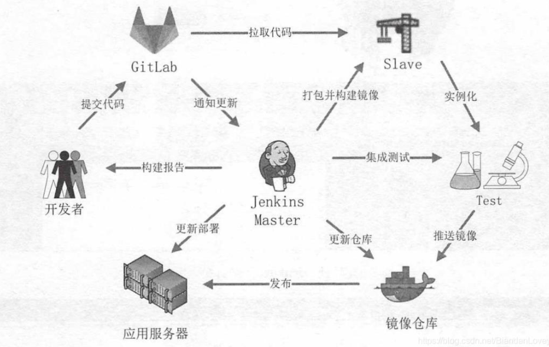

1、开发者向 GitLab 或者 Gitee 或者 GitHub 提交代码。

2、GitLab 使用 WebHook 通知 Jenkins 有代码更新。
3、Jenkins 从节点拉取代码，并打包生成镜像。
4、Jenkins 在从节点上使用生成的镜像运行测试用例。
5、如果测试通过，将镜像推送到镜像仓库中。
6、Jenkins 在应用服务器上更新部署。
7、Jenkins 将构建过程的报告以邮件的方式通知相关人员。

从开发人员向代码库提交代码之后，整个流程都是自动进行的。如果中间哪个环节出现错误，将会中止流程的执行，并将结果通知相关人员。提交的代码不但要包括应用程序，还应该包括构建镜像的脚本、测试用例的脚本和部署的编排脚本等。

其中，各个步骤的操作可以使用插件或直接在命令行中使用各种工具来完成。
例如，拉取项目代码将会用到 Git 插件，项目的打包将使用 Maven 工具来实现，生成镜像和应用部署将直接通过命令行来使用 Docker-compose 工具，而集成测试也将通过命令行来执行由 Selenium、JMeter 等工具生成的脚本。

## 部署jenkins环境

1.首先你需要安装jdk

2.

```shell
mkdir jenkins
yum -y install https://mirrors.tuna.tsinghua.edu.cn/jenkins/redhat/jenkins-2.347-1.1.noarch.rpm
```

下载完毕后就自动安装了

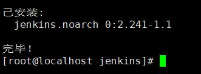

安装后，先别启动。

首先修改端口号，否则默认的8080端口，可能会与其他应用起冲突。

再修改运行用户，

```shell
vim /etc/sysconfig/jenkins
```

修改`JENKINS_USER`的值为root

然后就可以启动jenkins了

```shell
systemctl start jenkins
```

​	查看运行状态

```shell
systemctl status jenkins
```

设置jenkins开机自启

```shell
systemctl enable jenkins
```

然后通过ip:端口后，就可以打开jenkins了


## 遇到的问题

### 端口号修改

按照网上的方案：“修改/etc/sysconfig/jenkins中的JENKINS_PORT”即可，可是这样并没有一点用。

当你重启jenkins后，端口号还是用的默认的。

我也很纳闷，为什么一篇错误的文章居然被一群人反复的抄？不累吗？

正确解决方法如下：

1.首先你启动jenkins后，查看jenkins的运行状态。

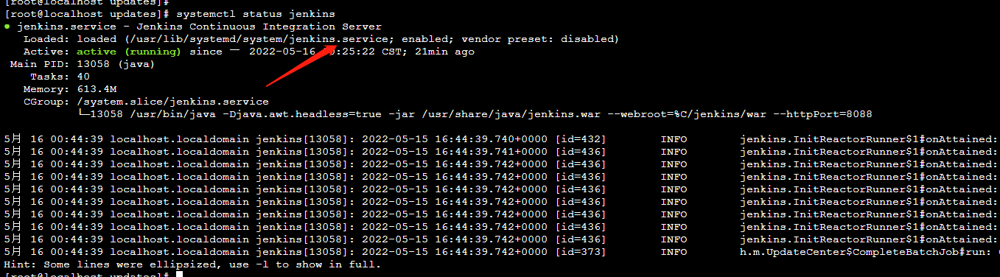

直接去这个文件中，修改端口号

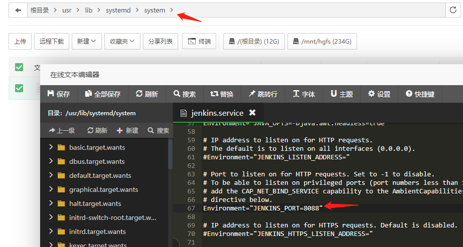

我平常更喜欢可视化的操作，因为快捷方便。

```shell
systemctl daemon-reload
```

然后重启就ok了。

### 卡在启动页


这些国外的软件，网络还是不够友好，所以需要换源解决。

```shell
cd /var/lib/jenkins/
```

修改`hudson.model.UpdateCenter.xml`文件，

`url`的值修改为`https://mirrors.tuna.tsinghua.edu.cn/jenkins/updates/update-center.json`

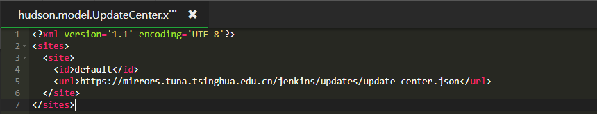

然后重启即可

### 安装插件，版本兼容问题

安装一些插件的时候，提示jenkins版本低于x.x.x。于是，我用了建议的版本。顺便记录一下，下载地址。

https://mirrors.tuna.tsinghua.edu.cn/jenkins/redhat/

### 发送HTML报告显示不全

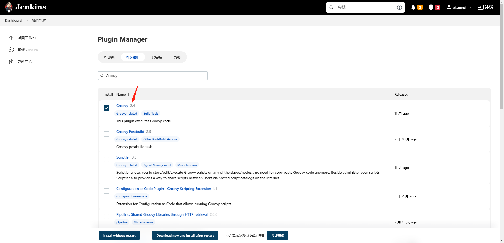

先安装`Groovy`插件，在增加构建步骤里添加：`Execute system Groovy script`

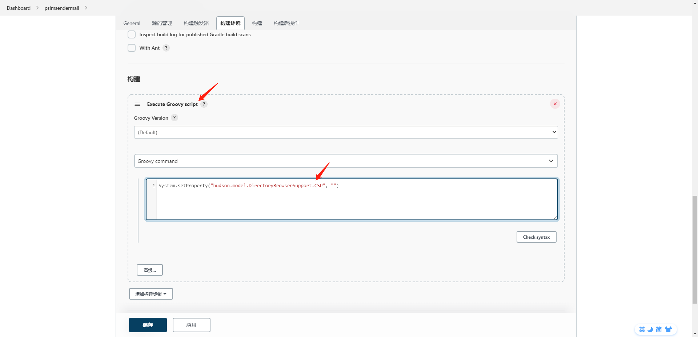

配置脚本命令行

```java
System.setProperty("hudson.model.DirectoryBrowserSupport.CSP",  "script-src 'unsafe-inline'")
```

然后去bulid now，你会发现报错

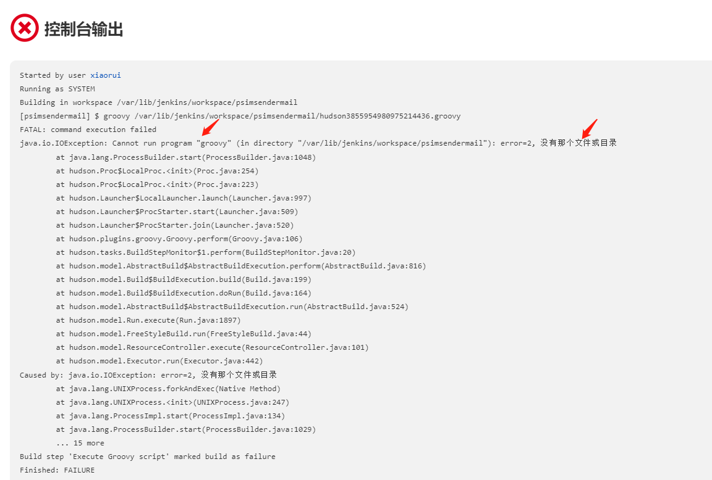

还需要去设置（`Manage Jenkins->Global Tool Configuration`）里面配置`Groovy`，

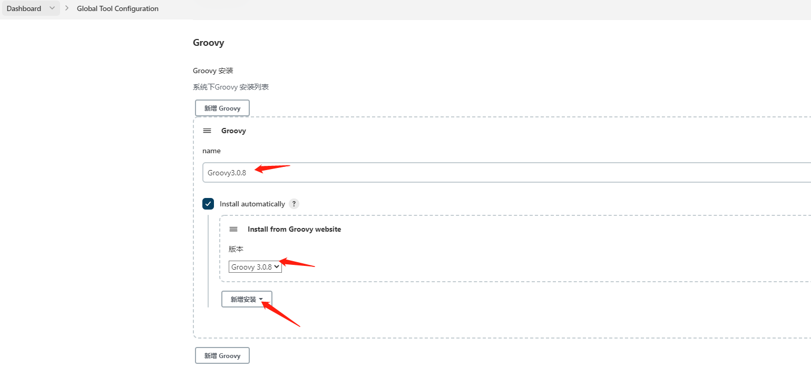

在项目配置中，选择`Groovy`的版本，就ok了。

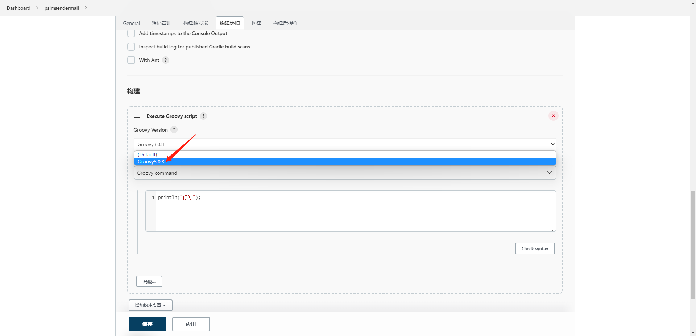

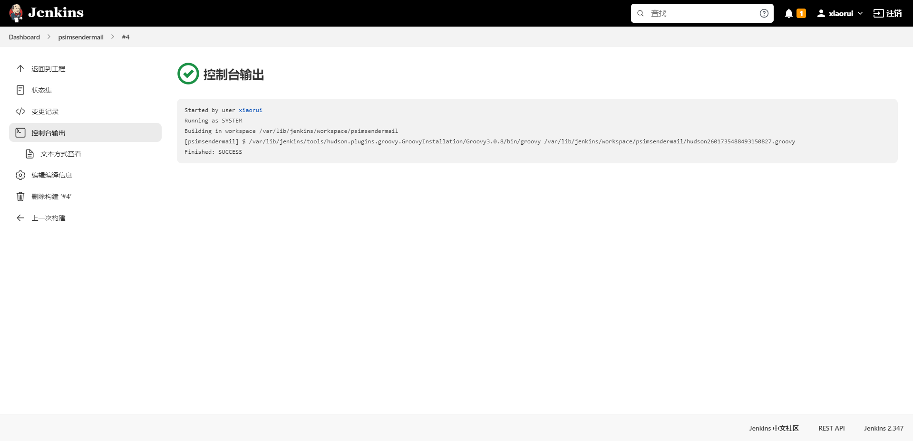


### 最新版jenkins-设置邮件提醒

参考文章：https://blog.csdn.net/weixin_42297382/article/details/122776307

