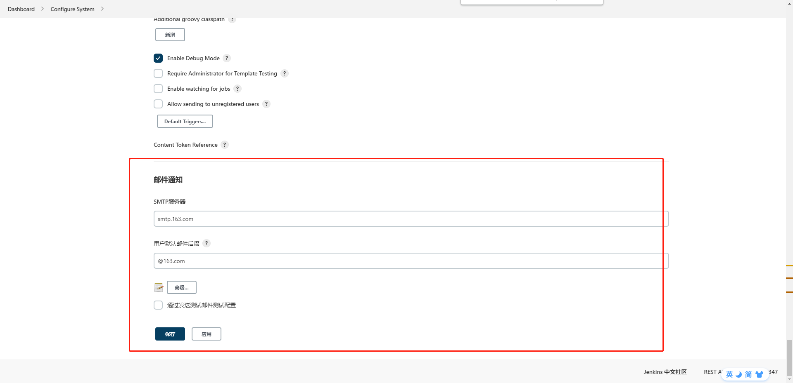
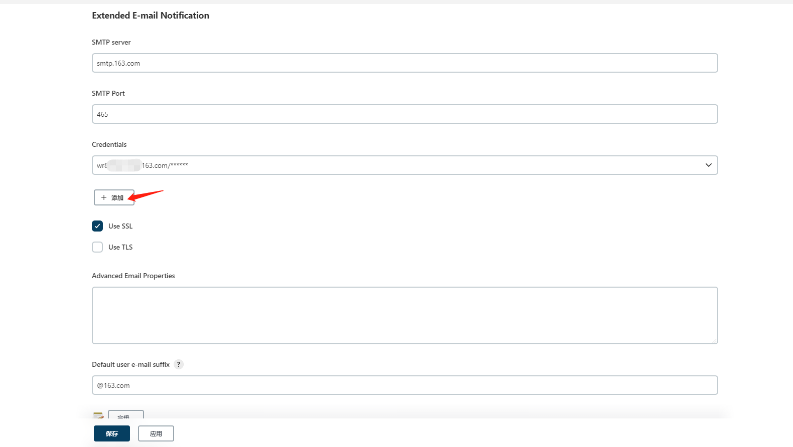
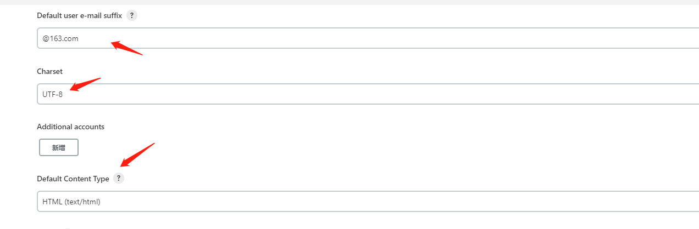
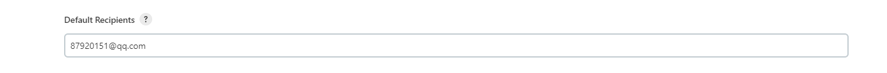
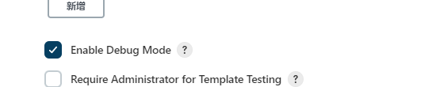
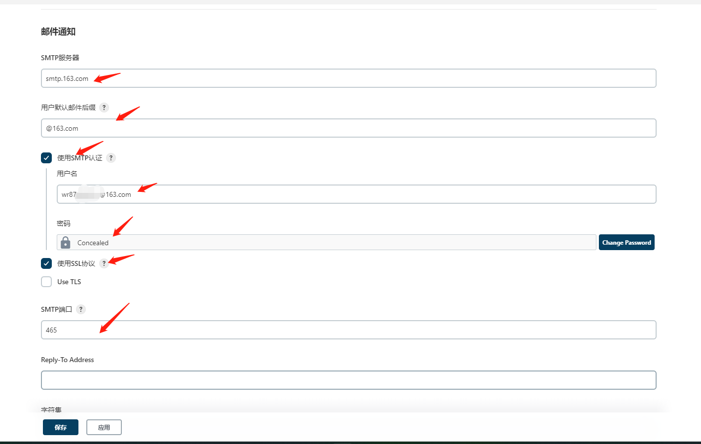
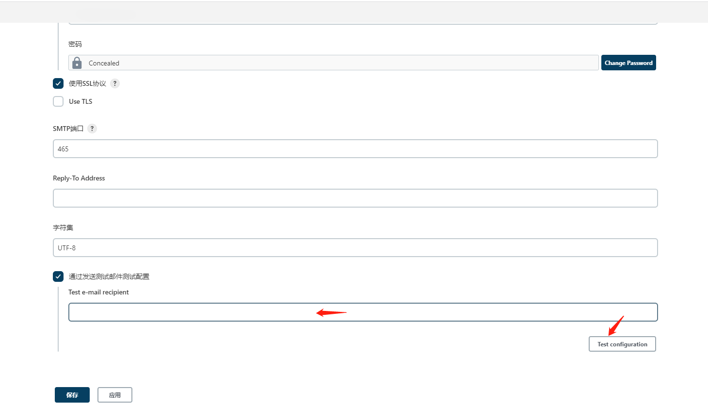
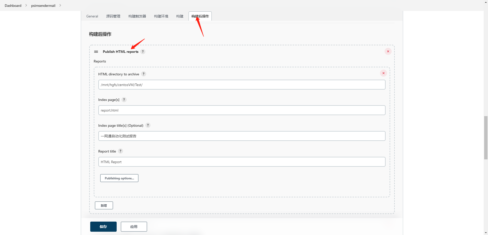
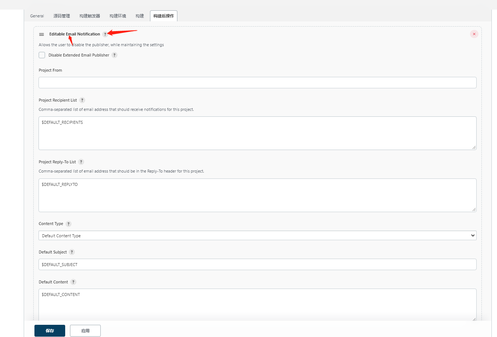
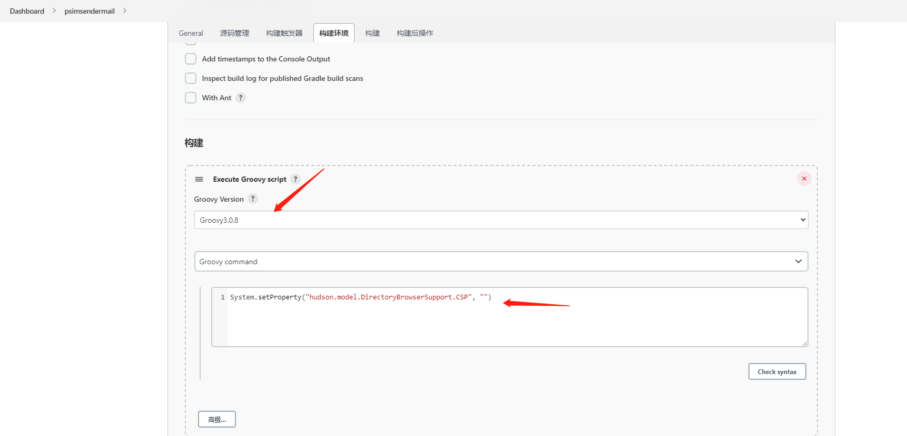

# 最新版jenkins--邮件提醒

昨晚安装了最新版的jenkins，设置邮件通知遇到了难题。发现跟之前老版本的区别有点大。

看到了一篇博主整理的，我负责把此文章copy下来。防止失效~

## jenkins配置邮件提醒参数

1.进入`manage plugins`页面

2.安装以下插件

```
HTML publisher
Email Extension
Email Extension Template
```

3.安装完毕后，进入`Configure System`页面

填写



4.`Configure System`页面找到`Extended E-mail Notification`



5.添加后，选择添加的邮箱账号，勾选Use SSL





6.设置`Default Recipients`，默认收件人

7.勾选`Enable Debug Mode`：这时如果发送不出邮件，日志中会包含详细的错误信息。



8.设置邮件通知参数



9.填写一个邮箱，测试一下是否发送成功。



以上就是邮件通知的操作步骤。

## 集成到项目中

步骤：

1.项目-配置



`构建后操作`添加`Publish HTML reports`，配置如上。

添加`Editable Email Notification`，配置如下。



1. Project Recipient List：填写收件人
2. Content Type：选择HTML(text/html)
3. Default Subject：输入邮件的默认标题
4. Default Content：复制进邮件的模板(是一大段html代码)

然后保存就可以了。

## 可能遇到的问题

如果收到的邮箱格式不正确，可以在项目-配置-构建环境中配置`Execute Groovy script`



```java
System.setProperty("hudson.model.DirectoryBrowserSupport.CSP",  "script-src 'unsafe-inline'")
```

这样就可以解决这个问题。

最后你可以Build Now，测试一波~

## 参考

https://blog.csdn.net/weixin_42297382/article/details/122776307