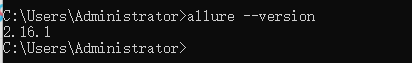
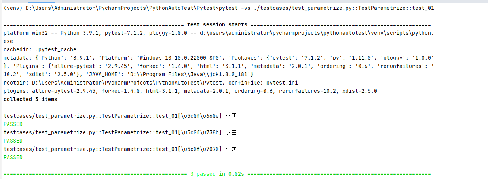
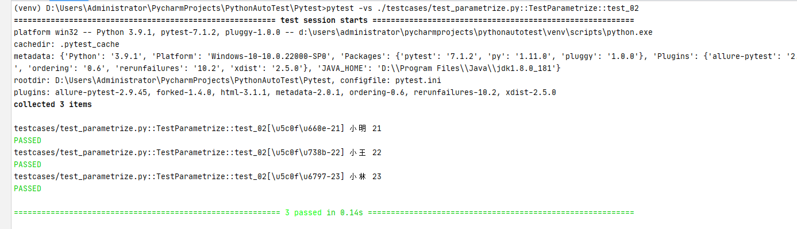

# pytest自动化测试框架

## 代码地址

https://github.com/xiaorui16888/AutoTest_Note

## 前言

pytest是一个非常成熟的python的单元框架，比unittest更灵活。

## 特点

pytest可以和selenium，requests，appium结合实现web自动化，接口自动化，app自动化。

pytest可以实现测试用例的跳过以及reruns失败用例重试。

pytest可以和allure生成非常美观的测试报告。

pytest可以和Jenkins持续集成。

## 插件

pytest有很多非常强大的插件，并且这些插件能够实现很多的实用的操作。

pytest-xdist：测试用例多线程或分布式执行

pytest-ordering：用于改变测试用例的执行顺序（从上到下）

pytest-rerunfailures：用例失败后重跑

pytest-html：生成html格式的自动化测试报告

allure-pytest：用于生成美观的测试报告

## 测试用例规则

1.模块名必须以`test_`开头或者`_test`结尾

2.测试类必须以`Test`开头，并且不能有`init`方法

3.测试方法必须以`test`开头

## 运行方式

### 主函数模式

1.运行所有

```python
pytest.main()
```

2.指定模块

```python
pytest.main(['-vs','test_login.py'])
```

3.指定目录

```python
pytest.main(['-vs','./interface_testcase'])
```

4.通过nodeid指定用例运行：nodeid由模块名，分隔符，类名，方法名，函数名组成。

```python
pytest.main(['-vs','./interface_testcase/test_interface.py::test_04_func'])
```

### 命令行模式

1.运行所有

```shell
pytest
```

2.指定模块

```shell
pytest -vs test_login.py
```

3.指定目录

```shell
pytest -vs ./interface_testcase
```

4.指定nodeid

```shell

pytest -vs./interface_testcase/test_interface.py::test_04_func
```

#### 参数详解

> -s：表示输出调试信息，包括print打印的信息
>
> -v：显示更详细的信息
>
> -vs：这两个参数一起用
>
> -n：支持多线程或者分布式运行测试用例。如：pytest-vs./testcase/test_login.py-n2
>
> --reruns NUM：失败用例重跑
>
> -x：表示只要要一个用例报错，那么测试停止。
>
> --maxfail=2出现两个用例失败就停止。
>
> -k：根据测试用例的部分字符串指定测试用例。
>
> 如：pytest-vs./testcase-k"ao"
>
> --html  ./report/report.html：生成html的测试报告。
>
> -m xxx ：表示只运行xxx标签的用例

### 通过读取pytest.ini全局配置文件运行

`pytest.ini`这个文件它是pytest单元测试框架的核心配置文件。

1.位置：一般放在项目的根目录

2.编码：必须是`ANSI`，可以使用notpad++修改编码格式。

3.作用：改变pytest默认的行为。

4.运行的规则：不管是主函数的模式运行，命令行模式运行，都会去读取这个配置文件。

```ini
[pytest]
addopts = -vs #命令行的参数，用空格分隔
testpaths = ./testcase #测试用例的路径
python_files = test_*.py #模块名的规则
python_classes = Test* #类名的规则
python_functions = test #方法名的规则
markers =
	smoke:冒烟用例
	usermanage:用户管理模块
	wechat:微信模块
```

## pytest执行测试用例的顺序

默认从上到下

若需要改变执行顺序：使用mark标记

```python
@pytest.mark.run(order=3)
```

## 如何分组执行

```shell
pytest -m "smoke"
pytest -m "smoke or usermanage or wechat"
```

## 跳过测试用例

### 无条件跳过

```python
@pytest.mark.skip(reason="无条件")
```

### 有条件跳过

```python
@pytest.mark.skip(age>18,reason="已成年")
```

## 前后置

### setup、teardown、setup_class、teatdown_class

```python
class TestUser:

    def setup_class(self):
        print('每个类之前执行一次')
        print('在每个类执行前的初始化的工作：比如：创建日志对象，创建数据库的连接，创建接口的请求对象。')

    def teardown_class(self):
        print('每个类之后执行一次')
        print('在每个类执行后的扫尾的工作：比如：销毁日志对象，销毁数据库的连接，销毁接口的请求对象。')

    def setup(self):
        print('每个用例之前执行一次')
        print('在执行测试用例之前初始化的代码：打开浏览器，加载网页')

    def teardown(self):
        print('每个用例之后执行一次')
        print('在执行测试用例之后的扫尾的代码：关闭浏览器')
        
     def test_01_login():
        print('test_01_login')
        
```

### @pytest.fixture()装饰器

```python
@pytest.fixture(scope="",params="",autouse="",ids="",name="")
```

scope：@pytest.fixture标记的方法的作用域。

function(默认)，class，module，package/session.

params：参数化（支持，列表[]，元祖()，字典列表[{},{},{}]，字典元祖({},{},{})

autouse=True：自动使用，默认False

ids：当使用params参数化时，给每一个值设置一个变量名。一般是用不到的~

name：给表示的是被@pytest.fixture标记的方法取一个别名。当取了别名之后，之前的名称就不可以使用了。

```python
import pytest

@pytest.fixture(scope='function', params=["user1", "user2", "user3"])
def my_fixture(request):
    print(request.param)
    print('执行sql语句')
    yield request.param
    print('关闭数据库连接')

class TestUser:

    def test_d(self, my_fixture):
        print('test_d===' + my_fixture)
```

### 通过conftest.py和@pytest.fixture()结合使用

如：全局登录，模块的全局处理

1.conftest.py文件是单独存放的一个夹具配置文件，名称是不能更改。

2.用处可以在不同的py文件中使用同一个fixture函数。

3.原则上conftest.py需要和运行的用例放到统一层。并且不需要做任何的imprt导入的操作。

### 总结

setup/teardown，setup_class/teardown_class它是作用于所有用例或者所有的类

@pytest.fixtrue()它的作用是既可以部分也可以全部前后置。

conftest.py和@pytest.fixtrue()结合使用，作用于全局的前后置。

## allure-pytest插件（测试报告）

使用allure，不仅需要`pip install allure-pytest`，还需要安装allure，并且配置环境变量。

1.下载，解压，配置path路径。

https://github.com/allure-framework/allure2/releases

2.打开cmd，`allure --version`



这样就ok了

如果cmd窗口验证成功，pycharm提示找不到allure，重启pycharm即可

3.加入命令生成json格式的临时报告。

```shell
--alluredir ./temp
```

4.生成allure报告

```shell
os.system('allure generate ./temp -o ./report --clean')
```

## @pytest.mark.parametrize()基本用法

```python
@pytest.mark.parametrize(args_name,args_value)
```

args_name：参数名

args_value：参数值(列表，元祖，字典列表，字典元祖)，有多个值用例就会执行多少次

### 方式一

```python
@pytest.mark.parametrize('caseInfo', ['小明', '小王', '小灰'])
def test_parametrize(self, caseInfo):
   	print(caseInfo)
```



### 方式二

跟unittest里面的`ddt`--`@unpack`解包一样

```python
@pytest.mark.parametrize('name,age', [['小明', '21'], ['小王', '22'], ['小林', '23']])
def test_02(self, name, age):
    print(name, age)
```




## YAML文件--实现接口自动化

1、可以做配置文件

2、可以写测试用例（接口测试）

yaml是一种数据格式，支持注释，换行，多行字符串，裸字符串（整形，字符串）。

### 语法规则

1.区分大小写

2.使用缩进表示层级，不能使用tab键缩进，只能用空格（和python一样）

3.缩进没有数量的，只要前面是对其的就行。

4.注释是 `#`

其实我用tab键已经习惯了，在pycharm里面用tab代替空格好像也没事...

### 数据组成

Map对象，键值对

List数组，`-`开头

### 代码实现

这里其实没什么用文字去叙述的，我直接贴代码了

**读写yaml工具类**

```python
import yaml


class ReadConfig:
    def __init__(self, yaml_file):
        self.yaml_file = yaml_file

    def read_yaml(self):
        with open(self.yaml_file, encoding='utf-8') as f:
            file_dict = yaml.load(stream=f.read(), Loader=yaml.FullLoader)
            print(file_dict)

    def write_yaml(self, data):
        with open(self.yaml_file, encoding='utf-8', mode='w') as f:
            yaml.dump(data=data, stream=f, allow_unicode=True)


if __name__ == '__main__':
    # rc = ReadConfig('config.yaml')
    # rc.read_yaml()
    # rc.write_yaml({'User': {'name': '小睿', 'age': 24}})

    api_config = ReadConfig('api.yaml')
    api_config.read_yaml()

```

**测试用例类**

```python
# -*- coding: UTF-8 -*-
"""
@Project ：PythonAutoTest 
@File    ：inter.py
@IDE     ：PyCharm 
@Author  ：胖妞
@Date    ：2022/5/15 13:31
"""
import json
import unittest

import requests
from ddt import ddt, file_data


@ddt
class Inter(unittest.TestCase):
    @file_data('api.yaml')
    def test_01_get_token(self, **kwargs):
        print(kwargs)
        url = kwargs['request']['url']
        params = kwargs['request']['params']
        headers = kwargs['request']['headers']
        resp = requests.get(url, params=params, headers=headers)
        print(resp.text)
        result_dict = json.loads(resp.text)
        # 预期结果
        # 'assert': {'eq': {'expires_in': 7200}}
        self.assertEqual(kwargs['assert']['eq']['expires_in'], result_dict['expires_in'])


if __name__ == '__main__':
    unittest.main()

```

**config.yaml**

```yaml
User:
  age: 24
  name: 小睿
```

**api.yaml**

```yaml
-
  name: 获取鉴权码接口
  request:
    url: https://api.weixin.qq.com/cgi-bin/token
    method: get
    headers:
      Accept: '*/*'
      Content-Type: 'application/json'
    params:
      grant_type: client_credential
      appid: wxcf90023b26f51211
      secret: 997b02c7551e854d7b6c69188d022098
  assert:
      eq:
        expires_in: 7200
```

## 结语

其实我感觉自动化测试中，接口测试是最好做的。web、app自动化，封装一些常用的方法，接下来就是寻找元素，控制元素，断言...

知识还是需要去用文字沉淀的。加油！