# Postman接口自动化测试集成Jenkins（附报告生成+邮件推送）

> 接口测试的重点：检查接口参数的正确性，接口功能的完整性，输出结果的正确性，以及对各种异常场景的容错处理和权限控制。

## 接口测试流程

1.拿到接口API接口文档，如果没有接口文档，需要自己抓包。

再熟悉接口的业务功能，接口地址，鉴权方式，入参，出参，错误码等。

2、设计接口测试用例以及评审

**正例：**输入正确的入参，接口正常返回。

**反例：**

鉴权反例：为空，错误，过期...

参数反例：必填，参数类型错误，参数长度异常，错误码覆盖不正确...

其他场景：接口黑名单，接口调用次数限制，分页场景测试（负数页，0,1,5...）、列表返回数量等

3、使用接口测试工具Postman、Jmeter、Apifox等工具执行接口测试。

4、postman+newman+Jenkins+git实现持续集成（目标：输出报告和发送电子邮件）

## 注意

csrf_token：一般情况下有效期7-15天

access_token：一般情况下有效期是10分钟-2小时

token鉴权码：大部分是cookie、session和接口签名

具体看程序是如何设计的

## Postman工具

### 请求页签

params：get参数一般放置这里

Authrization：鉴权

Headers：请求头

Body：一般post请求传参在这里

form-data：可以传输key=value，还可以上传文件

x-www-form-urlencoded：只能传输key=value

raw：Text、JavaScript、json、html、xml

binary：把文件当成二进制的方式传输

Pre-request-script：前置处理脚本

Tests：请求之后的断言等操作（比如操作环境变量等）

Cookies：Postman管理cookie信息。

### 响应页签

Body：返回的信息

Pretty：各种格式查看返回数据

Raw：文本格式

Preview：网页

Cooke：响应cookie

Header：响应头

Test Result：测试结果

### 接口关联

将获取到的值，使用处理json的函数或者正则表达式提取后，然后设置环境变量或者全局变量。

其他接口进行变量引用，实现接口之间的关联。

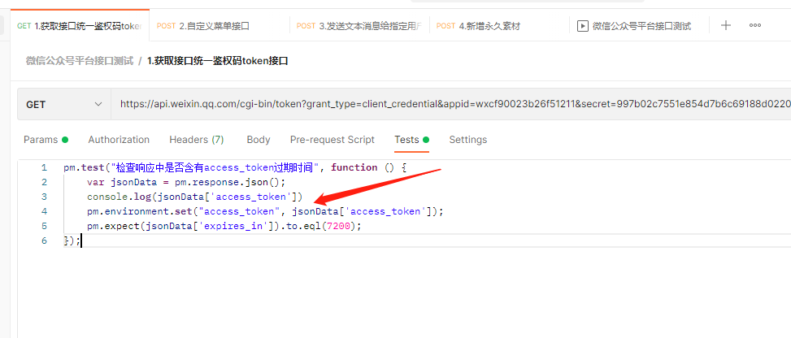

```javascript
pm.test("检查响应中是否含有access_token过期时间", function () {
    var jsonData = pm.response.json();
    console.log(jsonData['access_token'])
    pm.environment.set("access_token", jsonData['access_token']);
    pm.expect(jsonData['expires_in']).to.eql(7200);
});
```

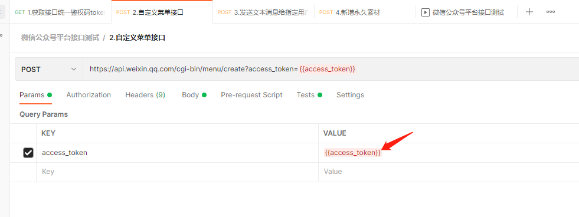

### 全局变量和环境变量

`全局变量`可以在所有接口请求中使用。

`环境变量`仅可以在当前选中环境的所有接口使用。

如：开发环境、测试环境、生成环境、预发布环境

### 内置动态参数以及自定义动态参数

`内置参数：`

`{{$timestamp}}` 自动生成当前时间的时间戳

`{{$randomInt}}`生成0-1000的随机数

`{{$guid}}` 生成一个GUID长字符串随机数

`自定义动态参数：`

1、自定义时间戳

```javascript
//获取当前系统时间
var times=Date.now()
//把当前时间设置为全局变量
pm.globals.set("times",times)
```

其实这里的代码就是js的语法，你掌握js语法的话，可以写出一堆动态参数...所以懂开发的测试，做测试工作更舒服~

### 断言

一般分为：状态码断言和业务断言。

状态码：接口响应码，比如200,404

业务断言：断言接口响应中的一些关键字。

#### 常用的断言

1.StatusCode: Code is 200

断言返回的状态码为200（常用）

2.Response body：Contains string

断言返回的body中包含有一个字符串

3.Response body：JSON value check

检查json中的其中的一个值

4.Response body：is equal a string

断言返回的body等于一个字符串

5.Response headers：

断言响应头包含Content-Type

6.Response time is less than 200ms

断言请求的时间少于200ms

#### 注意

自定义动态参数的断言方式：

在`test`页签内不能通过{{}}方式去获取全局变量，只能通过如下方式

```javascript
pm.globals.get("times")
globals["times"]
globals.times
```

**全局断言：一般应用于所有的结果都需要做的断言，比如状态断言。**

### 文件上传存在的问题

在postman设置中打开这个选项

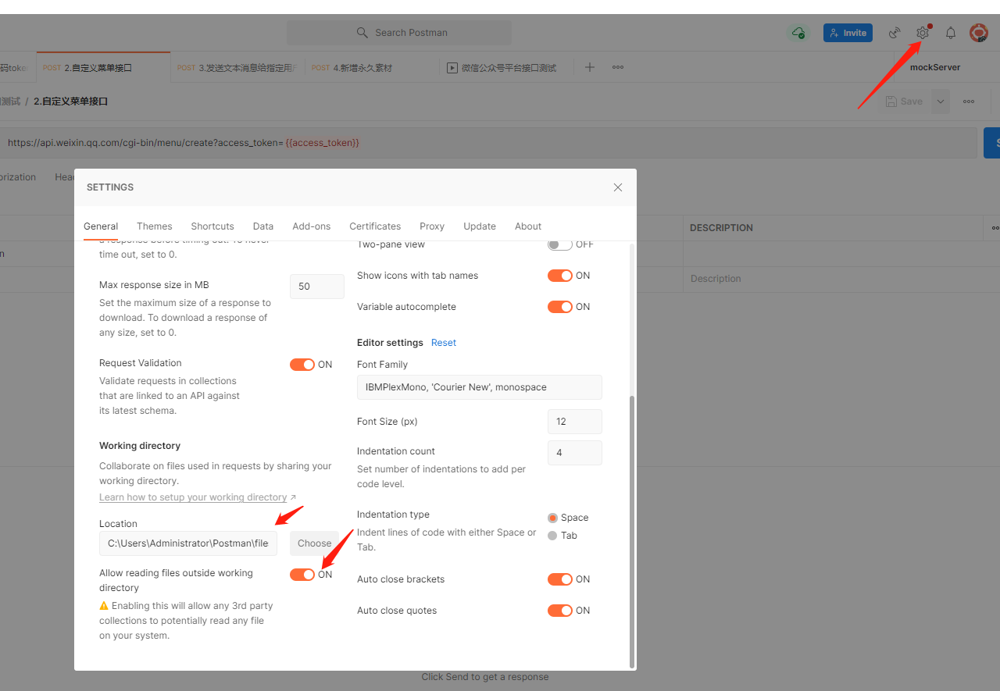

再把上传需要用到的文件，放到该路径下。

### 数据驱动方式

一种是csv，一种是json。

其实我更喜欢json，一目了然！

```javascript

if(responseBody.search("access_token"!=‐1)){
	console.log(responseBody);
	//正则表达式提取器,match匹配，new RegExp新建正则表达式
	var data =responseBody.match(new RegExp('"access_token":"(.*?)"'));
	//取值并设置为全局变量
	pm.globals.set("access_token",data[1]);
}
```

在断言里取数据文件里面的值：`data.变量名`

### 批量执行测试用例

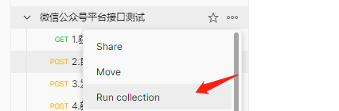

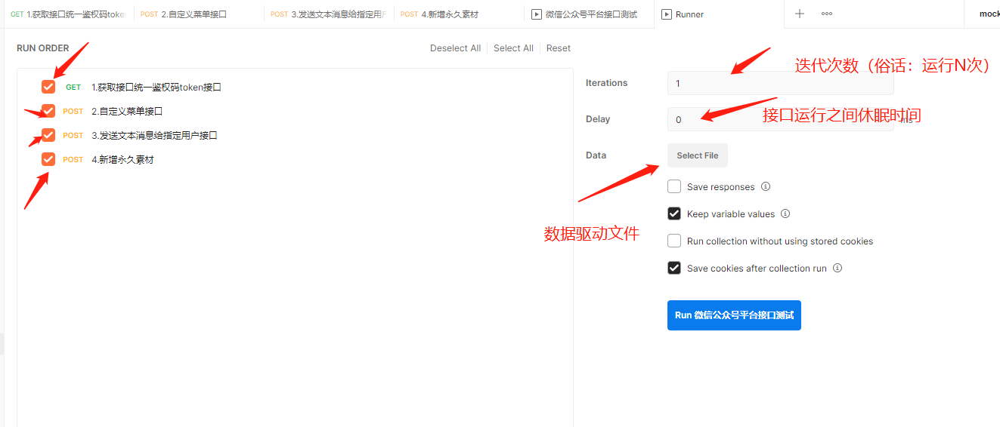

### Mock Server服务器

使用场景：前后端分离，后端接口没有完成，但是前端已经完成了，前端的业务流程依赖于后端的接口，如果需要测试，则需要自己mock接口。

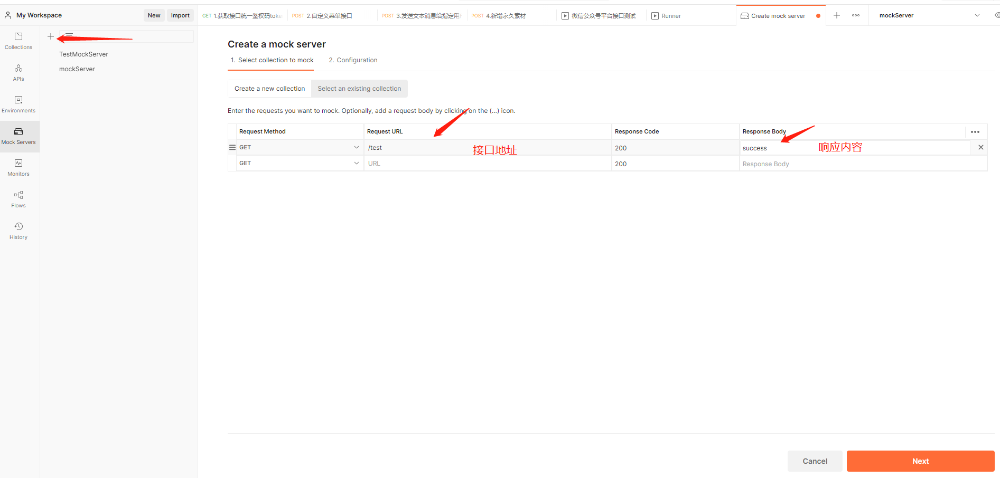

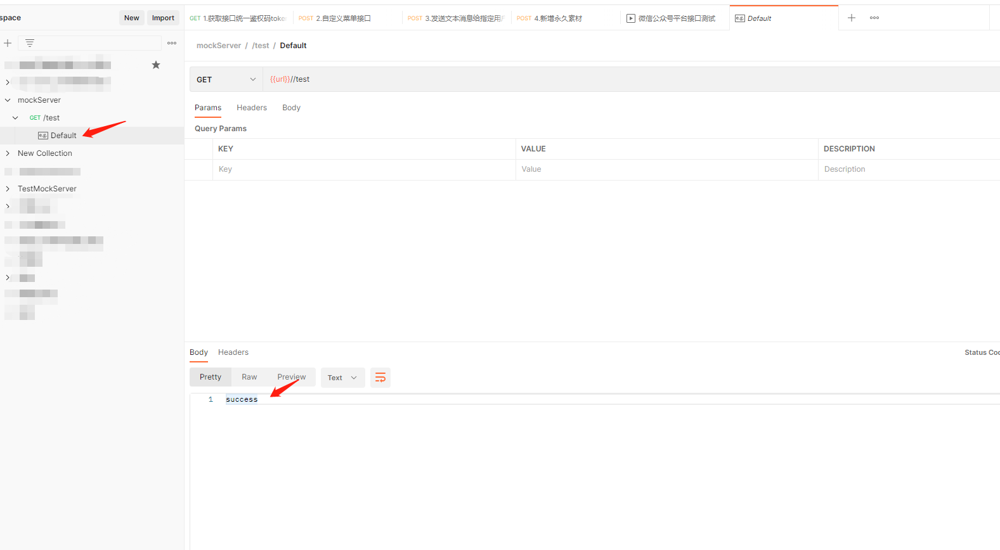

然后可以在default里面修改响应的内容。

有个工具-fiddler，我平常用它来抓包，他可以劫持数据，不可以mock。我发现很多人会把这两者混淆~

### 接口加密解密

一般来说，接口参数提交之前，会加一些签名，也就是所谓的加密。

我们可以在Pre-request-test页签内，借助js代码中的加密函数`CrytoJs.MD5()`进行加密。然后参数中再进行引用。

## Postman+Newman实现非GUI方式运行

1.导出接口测试项目中的：测试用例，全局变量，环境变量，数据文件

```shell
newman run postman_collection.json -e environment.json -r cli,html,json,junit --reporter-html-export report.html
```

`newman run`固定命令

-e 环境环境

-g 全局变量

-r cli,html,json,junit --reporter-html-export 报告文件名称 

生成html报告

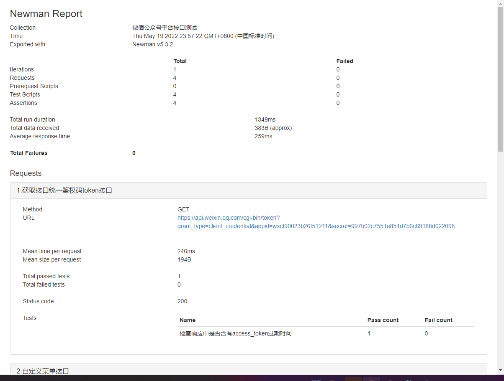

一般我们电脑没有newman的环境，首先需要安装nodejs环境，接下来需要安装依赖。

```shell
npm install newman -g

npm install newman-reporter-html -g
```

## Postman+Newman+Jenkins实现邮件发件

设置工作空间

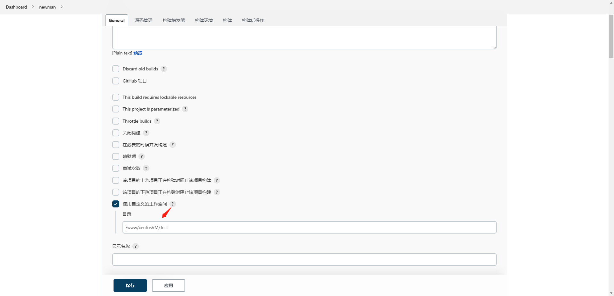

添加报告生成命令和防止报告生成样式缺失命令

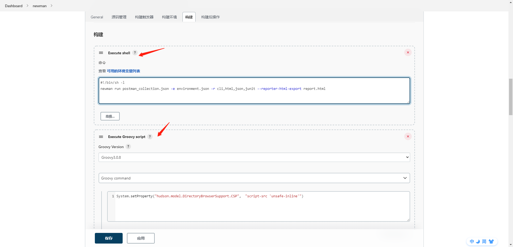

shell命令前一定要加`#!/bin/sh -l`，原因如下图。

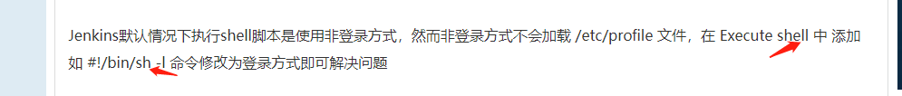

```shell
#!/bin/sh -l
newman run postman_collection.json -e environment.json -r cli,html,json,junit --reporter-html-export report.html
```

```java
System.setProperty("hudson.model.DirectoryBrowserSupport.CSP",  "script-src 'unsafe-inline'")
```

设置html输出路径等操作

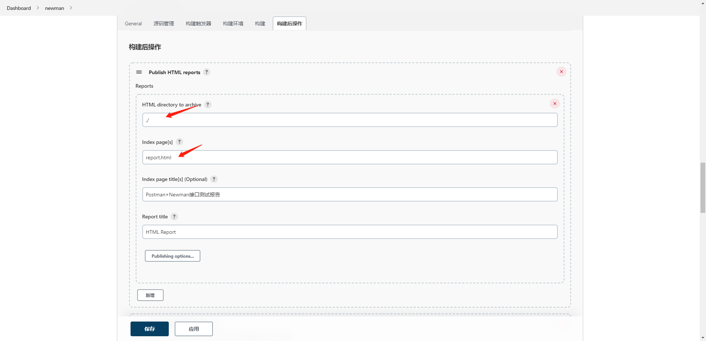

设置邮件推送

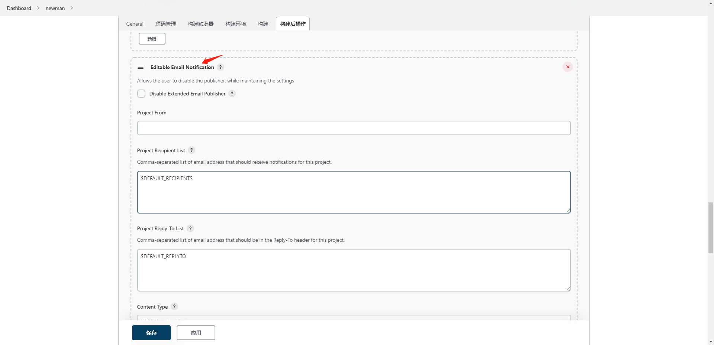

设置邮件附件内容以及邮件内容

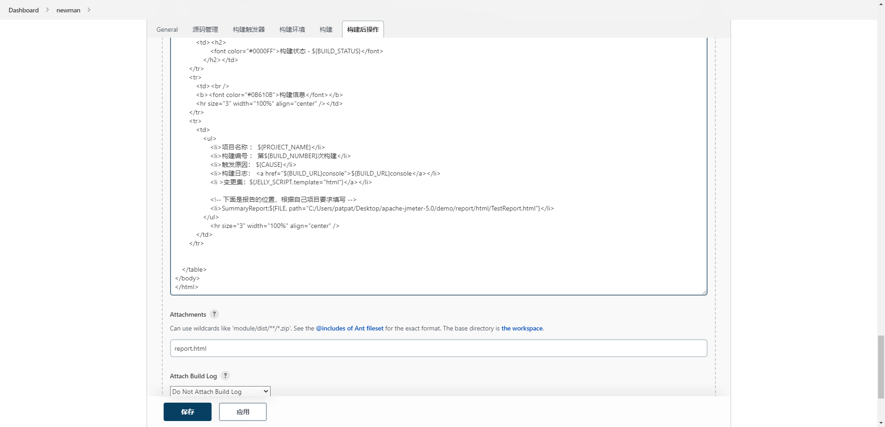

模板内容示例，这种东西一般公司都是有模板的，没有的话，可以去网上找。

```html
<!DOCTYPE html>
<html>  
<head>
<meta http-equiv="Content-Type" content="text/html; charset=utf-8" />  
<title>${PROJECT_NAME}-第${BUILD_NUMBER}次构建日志</title>  
</head>  
  
<body size="4" leftmargin="8" marginwidth="0" topmargin="8" marginheight="4"  
    offset="0">  
    <table width="95%" cellpadding="0" cellspacing="0"  
        style="font-size: 30pt; font-family: Tahoma, Arial, Helvetica, sans-serif">  
        <tr>  
            <td>(本邮件是程序每天定时下发，有问题请联系测试！（公司之后的外网无法打开邮件里的 URL）)</td>  
        </tr>  
        <tr>  
            <td><h2>  
                    <font color="#0000FF">构建状态 - ${BUILD_STATUS}</font>  
                </h2></td>  
        </tr>  
        <tr>  
            <td><br />  
            <b><font color="#0B610B">构建信息</font></b>  
            <hr size="3" width="100%" align="center" /></td>  
        </tr>  
        <tr>  
            <td>  
                <ul>  
                    <li>项目名称 ： ${PROJECT_NAME}</li>  
                    <li>构建编号 ： 第${BUILD_NUMBER}次构建</li>  
                    <li>触发原因： ${CAUSE}</li>  
                    <li>构建日志： <a href="${BUILD_URL}console">${BUILD_URL}console</a></li>  
                    <li >变更集：${JELLY_SCRIPT,template="html"}</a></li>  
 
                    <!-- 下面是报告的位置，根据自己项目要求填写 -->
                    <li>SummaryReport:${FILE, path="C:/Users/patpat/Desktop/apache-jmeter-5.0/demo/report/html/TestReport.html"}</li>  
                </ul>     
                    <hr size="3" width="100%" align="center" />
            </td>  
        </tr> 
    </table>  
</body>  
</html>
```

设置邮件发送触发规则

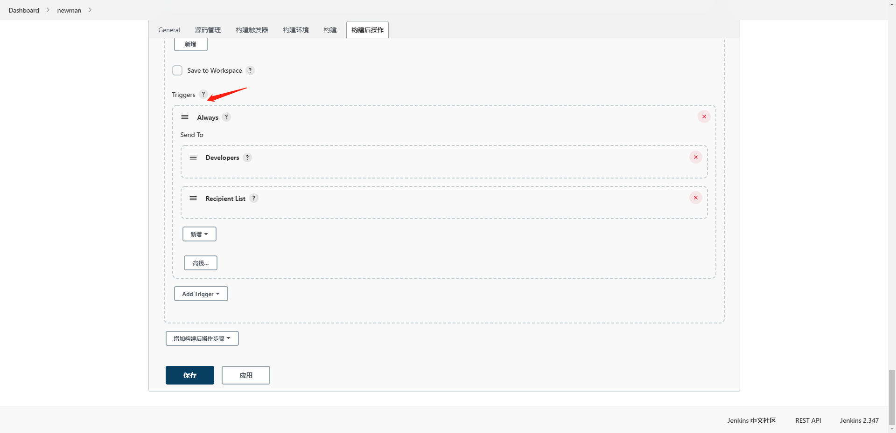

然后保存，运行一下。自己设置定时运行等~


## 结语

一般做接口测试的话，增删改查都会形成一个闭环。我们可以借助`环境变量`来实现接口之间的关联，实现增删改查。

其次有的公司除了使用postman，jmeter这类接口测试工具，还需要用到python实现接口自动化。

我个人觉得postman毕竟是做好的一款产品，一些功能你想借助它完成，编码比较局限。比如接口的签名，还有错误的排查，以及报告的生成样式比较单一化。接口关联，运行顺序，日志监控不那么的称心如意。以及postman只支持http协议。

再次，还有数据驱动也比较单一。使用python编码，可以更深层次的开发，实现一些postman无法实现的功能。