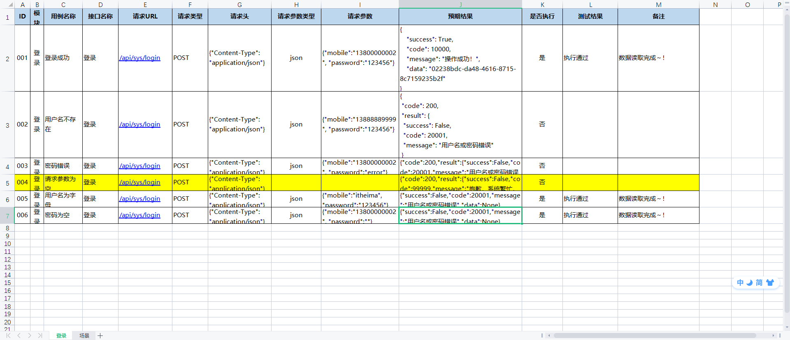

# python+Excel实现管理接口用例框架

之前在公司，接口自动化测试都是配置在yaml文件里面统一管理。

最近复习知识途中，发现还有一种上手简单的管理接口方式：Excel

就我认为，这种方式，对于刚入手接口自动化测试的人来说，是福音。只需要在excel表格中配置接口的信息，然后run程序，就可以生成接口测试报告了。

无需任何的编程基础。略懂接口就ok。

我也综合所学，封装了一套可以对excel接口用例管理的框架。

https://github.com/xiaorui16888/ExcelInterfaceCases

## 项目结构

api：接口请求方法的封装，如get、post、put、delete

data：数据存储文件，如excel用例，以及由excel用例生成的json格式的接口用例。

log：日志，这里记录错误日志，方便测试完成后分析结果。

reports：测试报告，allure

scripts：测试脚本，指定读取xxx.xlsx用例

tools：工具类，对excel、json操作，以及断言的封装

config.py：用例配置参数文件，如host，项目基础路径，excel数据对应列

pytest.ini：pytest框架配置文件

temps：allure临时文件