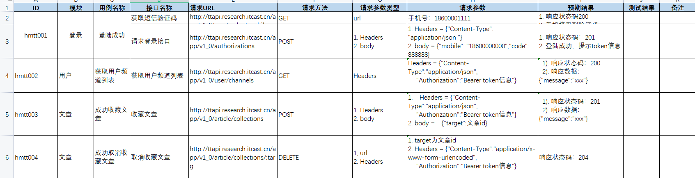

# python实战接口自动化头条项目

> 源码地址：
>
> https://github.com/xiaorui16888/TouTiao_Interface_Test

## 前言

这几天在巩固自己的知识，找到了一个`黑马程序员`的实战项目。对外开放了API接口文档（已失效），不过我费尽周折还是找到了新的接口，接口功能都是ok的。

我认为，做任何事情都要有一个流程。这样，做事情才会做到完美。当然`接口自动化`测试也有一套流程。

## 接口自动化测试流程

1.需求分析

	- 请求（url，请求方法，参数）
	- 响应（状态码，响应数据）

2.挑选需要做自动化的接口（计划时间，人员，接口复杂度）

​	因为一个项目中，不一定所有的接口都需要做自动化测试；包括哪些人员适合、可以做接口自动化；包括接口之间的关联。

3.设计自动化测试用例（如果功能阶段设计过用例，可以直接拿过来使用即可）

4.搭建自动化测试环境

如：python--编写方便，上手快；

​		pycharm--ide强大，功能多。

5.设计自动化执行框架（报告、参数化、用例执行框架）

6.编写代码

7.执行测试用例框架（unittest、pytest）

​	这两种框架，我一般做`错误重跑`、`测试报告`、`执行顺序`等用的是`pytest`，这个框架功能配套的插件很多（如：allure）。而且生成的测试报告比起`HTMLTestRunner` 也很美观。断言，一般用unittest，只需要类继承unittest.TestCase，就可以调用其中的断言函数。

8.生成测试报告（allure等）

## 接口清单整理

**请求：**

接口地址、请求方法、请求参数、请求头等

**响应：**

响应状态码、响应数据

## 用例设计

### 单接口

**模板：**

用例id、所属模块、接口名称、请求url、用例名称、请求方法、请求参数类型、请求参数、预期结果、实际结果、备注

**注意：单接口颗粒度放的比较小（以测试数据为颗粒度）**


### 多接口

**模板：**

用例id、所属模块、接口名称、请求url、用例名称、请求方法、请求参数类型、请求参数、预期结果、实际结果、备注

**注意：多个接口颗粒度为每个接口为基础，每个接口内所设计的数据可以通过参数化来解决。**



## 接口自动化项目框架

### 目录

1.接口对象层--api

2.用例执行业务层--case

3.数据驱动层--data

4.测试报告--report

5.工具层--封装公用的工具类

6.运行入口层--运行测试用例，生成测试报告


### 数据驱动问题

这里我是用json去存储接口数据的。如下代码：

```json
{
  "login_001": {
    "url": "http://toutiao.itheima.net/v1_0/authorizations",
    "mobile": "17612917750",
    "code": "246810",
    "except_code": "OK",
    "status_code": 201
  },
  "login_002": {
    "url": "http://toutiao.itheima.net/v1_0/authorizations",
    "mobile": "17612917750",
    "code": "123456",
    "except_code": "验证码不正确",
    "status_code": 400
  }
}
...
```

然后编写操作json工具类

```python
import json

from config import base_path


class JsonUtil:

    def __init__(self, filename):
        self.filepath = base_path + '/data/{}'.format(filename)

    # 读取json
    def read_json(self):
        with open(self.filepath, 'r', encoding='utf-8') as f:
            # 调用load方法加载文件流
            return json.load(f)

    # 写入Json
    def write_json(self, case):
        with open(self.filepath, "w", encoding="utf-8")as f:
            json.dump(case, f, indent=4, ensure_ascii=False)
```

使用`参数化`动态获取参数数据，ddt、unpack。

```python
import unittest

from ddt import ddt, data, unpack

from api.api_login import ApiLogin
from tools.json_util import JsonUtil


def get_data():
    json_datas = JsonUtil('login_more.json').read_json()
    arrs = []
    for json_data in json_datas.values():
        arrs.append((json_data.get('url'), json_data.get('mobile'), json_data.get('code'), json_data.get('expect_code'),
                     json_data.get('status_code')))
    # print(arrs)
    return arrs


@unittest.skip("跳过")
@ddt
class TestLoginMore(unittest.TestCase):

    @data(*get_data())
    @unpack
    def test_login_more(self, url, mobile, code, expect_code, status_code):
        # 调用登录方法
        resp = ApiLogin().api_post_login(url, mobile, code)
        print('查看响应结果：', resp.json())
        #
        # 断言响应信息及状态码
        self.assertEqual(expect_code, resp.json()['message'])
        self.assertEqual(status_code, resp.status_code)
```

### 运行主入口

```python
import os

import pytest

if __name__ == '__main__':
    # 运行测试套件
    pytest.main()
    # 生成临时报告数据，并清理之前生成的
    os.system('allure generate ./temps -o ./report --clean')
```

```ini
[pytest]
addopts =  -vs --alluredir ./temps --clean-alluredir
testpaths = ./case
python_files = test*
python_classes = Test*
python_functions = test*
```


