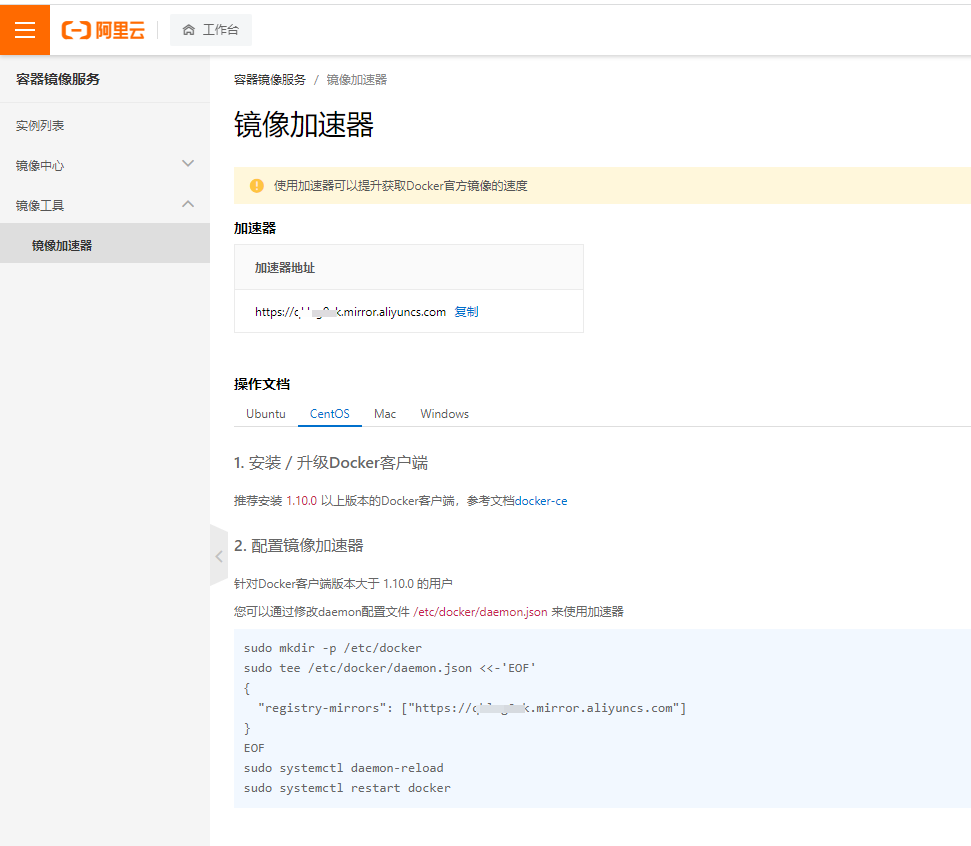

> 里面不仅有安装教程和对一些中间件的配置问题等 还有数据库的一些问题

<!-- more -->

## docker的安装

如果你是第一次安装需要注意

```shell
yum -y install gcc 
yum -y install gcc-c++
```
你需要设置镜像仓库为国内的仓库

```shell
 yum-config-manager --add-repo http://mirrors.aliyun.com/docker-ce/linux/centos/docker-ce.repo
```

然后安装docker引擎

```shell
 yum install docker-ce docker-ce-cli containerd.io
```

启动docker并测试

```shell
 systemctl start docker #启动docker
 docker version #查看docker版本
 docker run hello-world #运行hello-world
```
## 配置镜像加速

我们可以使用阿里云提供的加速 很简单直接登录自己的阿里云账号点击容器镜像服务找到镜像加速器直接黏贴他们提供的命令就可以了


## docker的常用命令

基础命令
```shell
systemctl start docker #启动docker
systemctl stop docker #停止docker
systemctl restart docker #重启docker
systemctl status docker #查看docker状态
systemctl enable docker #开机启动docker
docker info # 查看docker概要信息
docker --help #查看总文档帮助
docker 具体命令 --help #查看具体命令帮助文档
```

镜像命令
```shell
docker images #列出本地主机上的镜像
docker search 某个xx镜像的名字 #查找镜像
docker pull 某个xx镜像的名字 #拉取镜像
docker rmi 某个xx镜像的名字 #删除某个镜像的
docker system df #查看镜像/容器所占空间
docker rmi -f 某个xx镜像的名字 #强制删除删除某个镜像的
```

容器命令
```shell
docker run -it ubuntu /bin/bash #启动容器并返回一个交互窗口
docker run -it --name=wang ubuntu #启动容器并返回一个交互窗口
docker run -d mysql  #后台运行容器并返回容器id
docker ps #罗列出所有正在运行的容器
docker ps -a #罗列出所有的容器
exit #退出的话容器直接停止
ctrl+p+q #退出仍在运行
docker start 容器id或容器名 #启动已停止的容器
docker restart 容器id或容器名 #重启容器
docker stop 容器id或容器名 #停止容器
docker kill 容器id或容器名 #强制停止容器
docker rm 容器id #删除停止的容器
docker rm -f 容器id #强制删除停止的容器

docker exec -it 容器id或容器名 bash #重新进入已经启动的容器
docker export 容器名 > test.tar #备份容器为一个镜像
cat test.tar | docker import - wang/ubuntu:8.0.0 #把一个tar压缩包导入为一个镜像
```

在ubuntu里装载东西提交成一个新的镜像并复用
```shell
docker commit -m="add vim" -a="wang"  容器id/容器名 wang/ubuntu:1.1
```

安装tomcat&&mysql
```shell
docker run -d -p 8080:8080 --name mytomcat8 billygoo/tomcat8-jdk8

#1.简单版安装mysql 可以使用但是删除容器后数据库数据会丢失
docker pull mysql:8.0
docker run -p 3306:3306 --name mysql8.0  -e MYSQL_ROOT_PASSWORD=root123 -d mysql:8.0 #启动mysql 并设置root密码为root123


#2.挂在数据卷的方式挂载mysql 删除容器后数据不会丢失
docker run -d -p 3306:3306 --privileged=true -v /root/mysql/log:/var/log/mysql -v /root/mysql/data:/var/lib/mysql -v /root/mysql/cof:/etc/msyql/conf.d -e MYSQL_ROOT_PASSWORD=root123 --name mysql mysql:8.0
# 进入目录cof 创建my.cnf文件插入下面代码解决乱码问题
[client]
defaultcharacterset=utf8
[mysqld]
collation server=utf8 general ci character set server=utf8

```
redis的安装启动
```shell
#redis 容器数据卷的方式创建启动
mkdir -p /app/redis
......
```