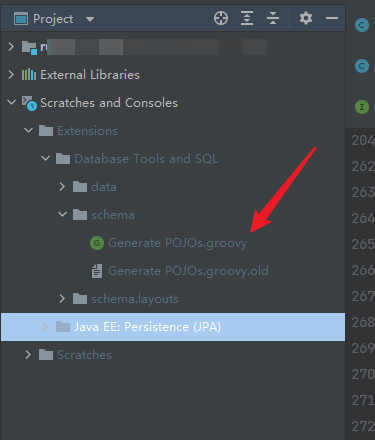
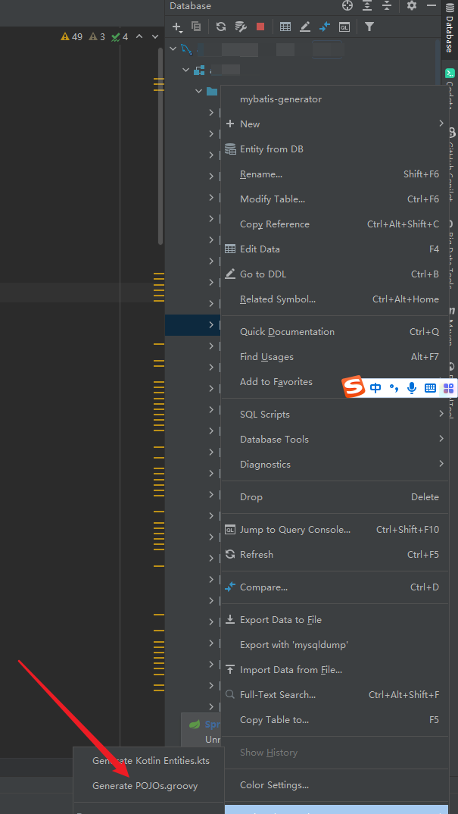

## 在idea的配置用来自动生成实体类的
这个生成出来的的实体类名字有一点问题 修改一下即可 内容没问题如果你有强迫症可自行修改
我只修改了一部分问题比如lombok和主键之类的都可以自己进行配置 不是很难

## 文件位置
**大概在你项目的最下面就可以看到这个文件打开**


## 文件内容
直接复制下面的代码替换进去里面的代码进行保存即可，傻瓜式操作```写的有问题的可自行修改```
```java
import com.intellij.database.model.DasTable
import com.intellij.database.model.ObjectKind
import com.intellij.database.util.Case
import com.intellij.database.util.DasUtil
import java.io.*
import java.text.SimpleDateFormat

/*
 * Available context bindings:
 *   SELECTION   Iterable<DasObject>
 *   PROJECT     project
 *   FILES       files helper
 */
packageName = ""
typeMapping = [
        (~/(?i)tinyint|smallint|mediumint/)      : "Integer",
        (~/(?i)int/)                             : "Long",
        (~/(?i)bool|bit/)                        : "Boolean",
        (~/(?i)float|double|decimal|real/)       : "Double",
        (~/(?i)datetime|timestamp|date|time/)    : "Date",
        (~/(?i)blob|binary|bfile|clob|raw|image/): "InputStream",
        (~/(?i)/)                                : "String"
]


FILES.chooseDirectoryAndSave("Choose directory", "Choose where to store generated files") { dir ->
    SELECTION.filter { it instanceof DasTable && it.getKind() == ObjectKind.TABLE }.each { generate(it, dir) }
}

def generate(table, dir) {
    def className = javaClassName(table.getName()+"Model", true)
    def fields = calcFields(table)
    packageName = getPackageName(dir)
    PrintWriter printWriter = new PrintWriter(new OutputStreamWriter(new FileOutputStream(new File(dir, className + ".java")), "UTF-8"))
    printWriter.withPrintWriter {out -> generate(out, className, fields,table)}

//    new File(dir, className + ".java").withPrintWriter { out -> generate(out, className, fields,table) }
}

//def generate(table, dir) {
//  def className = javaName(table.getName(), true)
 // def fields = calcFields(table)
 // new File(dir, className + ".java").withPrintWriter { out -> generate(out, className, fields) }
//}

// 获取包所在文件夹路径
def getPackageName(dir) {
    return dir.toString().replaceAll("\\\\", ".").replaceAll("/", ".").replaceAll("^.*src(\\.main\\.java\\.)?", "") + ";"
}

def generate(out, className, fields,table) {
    out.println "package $packageName"
    out.println ""
    out.println "import com.baomidou.mybatisplus.annotation.TableField;"
    out.println "import com.baomidou.mybatisplus.annotation.TableName;"
    out.println "import com.baomidou.mybatisplus.annotation.TableId;"
    out.println "import com.baomidou.mybatisplus.annotation.IdType;"
    out.println "import java.io.Serializable;"
    out.println "import lombok.Data;"
    out.println "import lombok.AllArgsConstructor;"
    out.println "import lombok.NoArgsConstructor;"
    Set types = new HashSet()

    fields.each() {
        types.add(it.type)
    }

    if (types.contains("Date")) {
        out.println "import java.util.Date;"
    }

    if (types.contains("InputStream")) {
        out.println "import java.io.InputStream;"
    }
    out.println ""
    out.println "/**\n" +
            " * @Description  \n" +
            " * @Author  wby\n" +
            " * @Date "+ new SimpleDateFormat("yyyy-MM-dd").format(new Date()) + " \n" +
            " */"
    out.println ""
    out.println "@Data"
    out.println "@AllArgsConstructor"
    out.println "@NoArgsConstructor"
    out.println "@TableName ( \""+table.getName() +"\" )"
    out.println "public class $className  implements Serializable {"
    out.println ""
    out.println genSerialID()
    fields.each() {
        out.println ""
        // 输出注释
        if (isNotEmpty(it.commoent)) {
            out.println "\t/**"
            out.println "\t * ${it.commoent.toString()}"
            out.println "\t */"
        }

        if (it.annos != "") out.println "   ${it.annos.replace("[@Id]", "")}"

        // 输出成员变量
        out.println "\tprivate ${it.type} ${it.name};"
    }

    // 输出get/set方法
//    fields.each() {
//        out.println ""
//        out.println "\tpublic ${it.type} get${it.name.capitalize()}() {"
//        out.println "\t\treturn this.${it.name};"
//        out.println "\t}"
//        out.println ""
//
//        out.println "\tpublic void set${it.name.capitalize()}(${it.type} ${it.name}) {"
//        out.println "\t\tthis.${it.name} = ${it.name};"
//        out.println "\t}"
//    }
    out.println ""
    out.println "}"
}

def calcFields(table) {
    DasUtil.getColumns(table).reduce([]) { fields, col ->
        def spec = Case.LOWER.apply(col.getDataType().getSpecification())

        def typeStr = typeMapping.find { p, t -> p.matcher(spec).find() }.value
        def comm =[
                colName : col.getName(),
                name :  javaName(col.getName(), false),
                type : typeStr,
                commoent: col.getComment(),
                annos: "\t@TableField( \""+col.getName()+"\" )"]
        if("guid".equals(Case.LOWER.apply(col.getName())))
            comm.annos ="@TableId( value = \""+col.getName()+"\", type = IdType.AUTO )"
        fields += [comm]
    }
}

// 处理类名（这里是因为我的表都是以t_命名的，所以需要处理去掉生成类名时的开头的T，
// 如果你不需要那么请查找用到了 javaClassName这个方法的地方修改为 javaName 即可）
def javaClassName(str, capitalize) {
    def s = com.intellij.psi.codeStyle.NameUtil.splitNameIntoWords(str)
            .collect { Case.LOWER.apply(it).capitalize() }
            .join("")
            .replaceAll(/[^\p{javaJavaIdentifierPart}[_]]/, "_")
    // 去除开头的T  http://developer.51cto.com/art/200906/129168.htm
    s = s[1..s.size() - 1]
    capitalize || s.length() == 1? s : Case.LOWER.apply(s[0]) + s[1..-1]
}

def javaName(str, capitalize) {
//    def s = str.split(/(?<=[^\p{IsLetter}])/).collect { Case.LOWER.apply(it).capitalize() }
//            .join("").replaceAll(/[^\p{javaJavaIdentifierPart}]/, "_")
//    capitalize || s.length() == 1? s : Case.LOWER.apply(s[0]) + s[1..-1]
    def s = com.intellij.psi.codeStyle.NameUtil.splitNameIntoWords(str)
            .collect { Case.LOWER.apply(it).capitalize() }
            .join("")
            .replaceAll(/[^\p{javaJavaIdentifierPart}[_]]/, "_")
    capitalize || s.length() == 1? s : Case.LOWER.apply(s[0]) + s[1..-1]
}

def isNotEmpty(content) {
    return content != null && content.toString().trim().length() > 0
}

static String changeStyle(String str, boolean toCamel){
    if(!str || str.size() <= 1)
        return str

    if(toCamel){
        String r = str.toLowerCase().split('_').collect{cc -> Case.LOWER.apply(cc).capitalize()}.join('')
        return r[0].toLowerCase() + r[1..-1]
    }else{
        str = str[0].toLowerCase() + str[1..-1]
        return str.collect{cc -> ((char)cc).isUpperCase() ? '_' + cc.toLowerCase() : cc}.join('')
    }
}

static String genSerialID()
{
    return "\tprivate static final long serialVersionUID =  "+Math.abs(new Random().nextLong())+"L;"
}
```
## 实际操作
首先连接数据库打开库找到你需要生成实体类的表右键选择下面的选项点了之后选择生成路径即可

