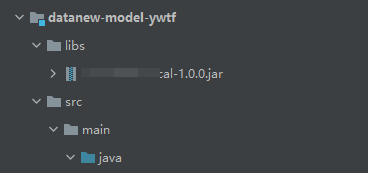

## 做个记录方便找一些常用注解
```java
//表中是否存在
@TableField(exist=false)
//时间处理
@DateTimeFormat(pattern = "yyyy-MM-dd hh:mm:ss")
@JsonFormat(pattern = "yyyy-MM-dd hh:mm:ss", timezone = "GMT+8")
```
## 传入list xml处理
```xml
<if test="status!=null and status.size>0">
  and gl.status in
    <foreach collection='status'  index="index"  item='item' open='(' separator=',' close=')'>
        #{item}
    </foreach>
</if>
```
## xml大于小于处理
```md
第一种写法（1）：

原符号       <        <=      >       >=       &        '        "
替换符号    &lt;    &lt;=   &gt;    &gt;=   &amp;   &apos;  &quot;
例如：sql如下：
create_date_time &gt;= #{startTime} and  create_date_time &lt;= #{endTime}

第二种写法（2）：
大于等于
<![CDATA[ >= ]]>
小于等于
<![CDATA[ <= ]]>
例如：sql如下：
create_date_time <![CDATA[ >= ]]> #{startTime} and  create_date_time <![CDATA[ <= ]]> #{endTime}
```
## sql时间处理
```sql
-- mysql
DATE_FORMAT(now(),'%Y-%m-%d %H:%i:%s')
-- orcal
to_char(sysdate,'yyyy-MM-dd HH24:mi:ss')
```
## 引入外部包
**一般公司自己的包 或者是对接公司他们自己的包maven仓库中没有的东西**\
\
合理的引入包路径不至于让别人也用idea去添加libs
```xml
<dependency>
    <groupId>com.test.bag</groupId> <!-- 包内路径 -->
    <artifactId>bag</artifactId>
    <version>1.0.0</version>
    <scope>system</scope>
    <systemPath>${project.basedir}/libs/bag-1.0.0.jar</systemPath>
</dependency>
```
## Excel导入导出
[poi 3.16 导入导出](https://blog.csdn.net/sunnyzyq/article/details/121994504)

## oracle存储过程
一、案例一
```sql
CREATE OR REPLACE procedure "demo"(v_code in varchar2,a out varchar2)
as
begin
    select count(*)  a from ZFTZ_TOWNS_FUND where PROGRAMGUID=v_code;
end;
```
二、案例二
```sql
CREATE OR REPLACE PROCEDURE "ZFTZ_TOWN_LIST_UPDATE" AS
	 bilcount VARCHAR2(15);
begin

   /*删除历史数据*/
   delete from  ZFTZ_TOWN_MX_LIST;
	 commit; 
	 
  /*遍历插入项目明细*/
  for rec in (select title from testtable where IS_DEL is null and PROASCRIPTION is not null) loop
   insert into testTable1(GUID,PRONAME,PROGUID,ZBJE,JHS,JHYE,ZFJE,LHWH)
	 select SYS_GUID(),t.name,t.guid,case when t.zbje is null then 0 else t.zbje end zbje,case when t.jhs is null then 0 else t.jhs end jhs,case when t.jhye is null then 0 else t.jhye end jhye,case when t.zfmoney is null then 0 else t.zfmoney end zfmoney,t.SUMMARY from V_ZFTZ_test t where t.guid = rec.PROGRAMGUID;
	 commit;
   /*查询支付令明细并更新到表中*/
   ZFTZ_BIL_COUNT(rec.PROGRAMGUID,bilcount);
   update testTable1 set MXTOTEL = bilcount where PROGUID =rec.PROGRAMGUID;
	 commit;
  end loop;

END;
```
## oracle 注解@Insert 返回主键
```java
@Insert("insert into test(ID,name,age,sex,zt) values(#{id},#{name},#{age},1,'04')")
@SelectKey(statement = "SELECT SEQ_TEST.NEXTVAL FROM DUAL",
        keyProperty = "id",
        resultType = Long.class,
        before = true
)
```
### mysql触发器
```sql
BEGIN
DECLARE plus_index int DEFAULT 0;
DECLARE v_sfid int DEFAULT 0;
DECLARE v_sjje decimal(16,2);
DECLARE t_error INTEGER DEFAULT 0;

DECLARE cursor_plus CURSOR FOR (
		select zh.sfid,zh.je_mx from test zh where new.guid = zh.zjsftzdid
	);
	
DECLARE CONTINUE HANDLER FOR NOT FOUND SET plus_index=1;

if (OLD.jfzt='1'and NEW.jfzt='9') then
	
	open cursor_plus;

		fetch cursor_plus into v_sfid,v_sjje;

		while plus_index<>1 do
		
			update test jh set sjje=sjje+v_sjje,sftzdwjye=sftzdwjye-v_sjje,wjye=wjye-v_sjje WHERE jh.guid=v_sfid;
				
			fetch cursor_plus into v_sfid,v_sjje;
	end while;

	close cursor_plus;
end if;
END
```
