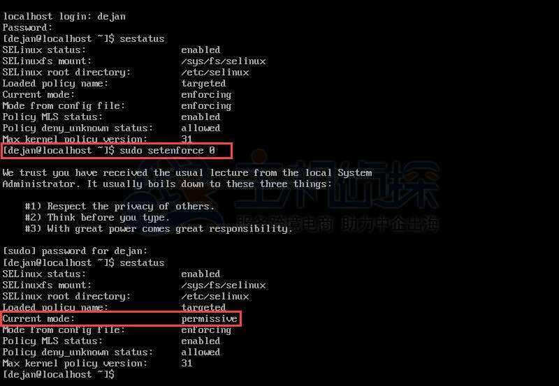

SELinux是Linux内核中内置的强制性访问控制（MAC）强制程序，它限制了漏洞可能对系统造成威胁的单个服务的特权。没有SELinux的CentOS系统依赖其所有特权软件应用程序的配置，单个错误配置可能会损害整个系统。CentOS 7如何关闭SELinux？本文将为CentOS 7关闭SELinux命令，仅供大家参考。

**一、为什么禁用SELinux？**

并非所有应用程序都支持SELinux。因此，SELinux可以在常规使用和安装软件包的过程中终止必要的过程。在这种情况下，我们建议您关闭此服务。

先决条件：

使用**sudo**特权访问用户帐户

访问终端/命令行

基于RHEL的系统，例如CentOS 7

文本编辑器，例如nano或vim

**二、在CentOS上关闭SELinux的步骤**

1、检查SELinux状态

默认情况下，CentOS和大多数其他基于RHEL的系统上启用SELinux服务。但是，您的系统可能并非如此。首先使用以下命令检查系统上SELinux的状态：

```output
sestatus 
```

下面的示例输出表明SELinux已启用，状态显示服务处于强制模式。


SELinux可能会阻止应用程序的正常运行。如果出现以下情况，该服务将拒绝访问：

- 文件标签错误。
- 不兼容的应用程序尝试访问禁止的文件。
- 服务在错误的安全策略下运行。
- 检测到入侵。

如果您发现服务运行不正常，请检查SELinux日志文件，日志位于/var/log/audit/audit.log中，大多数常见的日志消息都标有“ AVC”。如果找不到任何日志，请尝试查看/ var / log / messages。如果auditd守护程序未运行，则系统在该文件中写入日志。

**2、停用SELinux**

**（1）、暂时停用SELinux**

要临时禁用SELinux，请在终端中键入以下命令：

```output
sudo setenforce 0
```

在sudo setenforce 0中，可以使用宽松的而不是0。

此命令将SELinux模式从目标更改为许可。



在许可模式下，服务处于活动状态并审核所有操作。但是，它不执行任何安全策略，系统记录AVC消息。

该更改仅在下一次重新启动之前有效。要永久关闭SELinux，请参阅本文的下一部分。

**（2）、永久禁用SELinux**

要永久禁用该服务，请使用文本编辑器（例如vim或nano）并按照以下说明编辑/ etc / sysconfig / selinux文件。

打开/ etc / sysconfig / selinux文件，我们将使用vim。

输入以下命令以打开文件：

```output
sudo vi /etc/sysconfig/selinux
```

将SELINUX = enforcing指令更改为SELINUX = disabled。


保存编辑的文件。

**3、重新启动CentOS以保存更改**

为了使更改生效，您需要使用以下命令重新引导系统：

```output
sudo shutdown -r now
```

重新引导后，检查服务状态以确认SELinux已禁用。使用命令：

```output
sestatus
```


如上图所示，状态应为禁用，系统将不会加载任何SELinux策略或写入任何AVC日志。