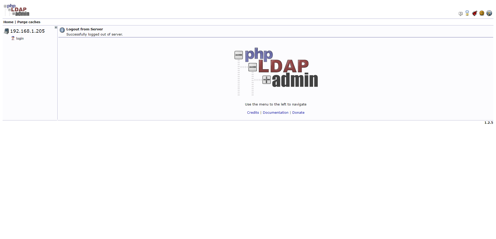
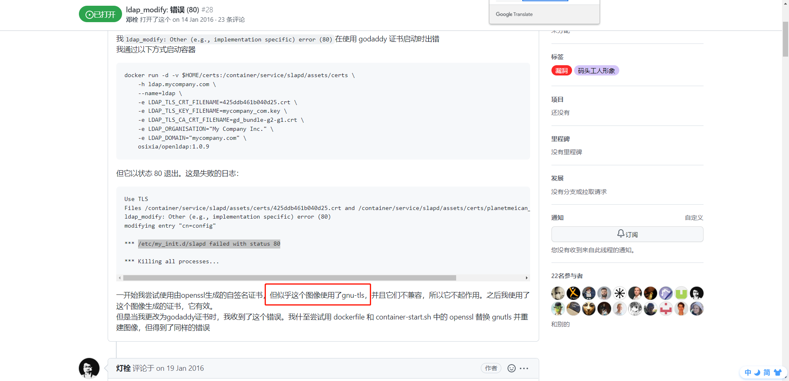

>OpenLDAP是一款轻量级目录访问协议(Lightweight Directory Access Protocol,LDAP)，属于开源集中账号管理架构的实现，支持众多系统版本。

本文采用docker容器的方式安装运行openldap镜像。使用docker安装方式配置简单，易用等特点。


## 安装docker

```shell
# 安装docker依赖包
yum install -y yum-utils device-mapper-persistent-data lvm2
# 配置国内阿里云镜像仓库，解决镜像下载慢的问题。
yum-config-manager --add-repo http://mirrors.aliyun.com/docker-ce/linux/centos/docker-ce.repo   
# 安装docker-ce服务
yum install docker-ce docker-ce-cli containerd.io

# 启动docker命令
systemctl start docker
# 添加到开机启动项
systemctl enable docker
```


## 拉取openldap与phpldapadmin镜像到本地

```shell
docker pull osixia/openldap
docker pull osixia/phpldapadmin
```


## 运行镜像

### 通过docker run命令运行openldap

```shell
docker run \
-p 389:389 \
-p 636:636 \
--name myldap_name \
--network bridge \
--hostname codesweet.com \
--env LDAP_ORGANISATION="codesweet" \
--env LDAP_DOMAIN="codesweet.com" \
--env LDAP_ADMIN_PASSWORD="123456" \
--volume /path/to/certificates:/container/service/slapd/assets/certs \
--env LDAP_TLS_CRT_FILENAME=ldap.crt \
--env LDAP_TLS_KEY_FILENAME=ldap.key \
--env LDAP_TLS_CA_CRT_FILENAME=ca.crt \
--detach osixia/openldap
```

> 注释如下:
> -p 389:389 \ TCP/IP访问端口
> -p 636:636 \ SSL连接端口
> –name myldap_name 容器名称为myldap_name
> –network bridge 连接默认的bridge网络
> –hostname openldap-host 设置容器主机名称为 openldap-host
> –env LDAP_ORGANISATION=“example” 配置LDAP组织名称
> –env LDAP_DOMAIN=“example.com” 配置LDAP域名
> –env LDAP_ADMIN_PASSWORD=“123456” 配置LDAP密码


### 通过docker run命令运行osixia/phpldapadmin

```shell
docker run \
-d \
--privileged \
-p 8989:80 \
--name myldapadmin \
--env PHPLDAPADMIN_HTTPS=false \
--env PHPLDAPADMIN_LDAP_HOSTS=192.168.1.205 \
--detach osixia/phpldapadmin
```

> 注释如下:
> -d 分离模式启动容器
> –privileged 特权模式启动(使用该参数，container内的root拥有真正的root权限。否则，container内的root只是外部的一个普通用户权限。)
> –env PHPLDAPADMIN_HTTPS=false 禁用HTTPS
> –env PHPLDAPADMIN_LDAP_HOSTS =172.16.109.91 配置openLDAP的IP或者域名，我安装ldap机器IP就是172.16.109.91。

通过访问phpldapadmin管理地址 http://192.168.1.205:8989 进行登录与管理，登陆界面如下：



点击login登录

```
Login DN：cn=admin,dc=codesweet.com,dc=com
Password：123456
```


可以配合`LDAP Admin` 工具管理LDAP。

## 疑难杂症

[仓库地址](https://github.com/osixia/docker-openldap#use-your-own-certificate)

---

我发现了一个很坑的问题！

用镜像里面自动生成的TLS证书，会出现 `/etc/my_init.d/slapd failed with status 80` 这样的问题。这问题足足搞了我两天...

经大佬和issues指点，使用 `gnutls`生成证书，才解决了这个问题。




[上述生成证书方法](/pages/102a52/)

---

一些ldap常用的命令

```shell
ldapwhoami -H ldap://localhost -x -ZZ   
	
ldapsearch -x -D "cn=admin,dc=codesweet,dc=com" -H ldaps://localhost -W -b "dc=codesweet;dc=com"
```

