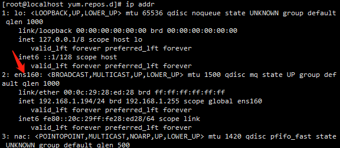

# centos安装后的配置工作


## 修改网络配置

在配置网络之前，我们需要知道centos的网卡名称

```shell
ip addr
```



修改网卡配置文件 

```shell
vi /etc/sysconfig/network-scripts/ifcfg-ens160
```

（1）bootproto=static

（2）onboot=yes

（3）在最后加上几行，IP地址、子网掩码、网关、dns服务器

```
IPADDR=192.168.1.194
NETMASK=255.255.255.0
GATEWAY=192.168.1.254
DNS1=114.114.114.114
DNS2=8.8.8.8
```

（4）重启网络服务

```html
systemctl restart network
```


## 更新yum源

1. 先安装 `wget`

2. 备份原来的yum源

   ```
   cd /etc/yum.repos.d
   ls
   mv CentOS-Base.repo CentOS-Base.repo_bak
   ```

3. 设置源为阿里云

   ```shell
   阿里云yum源：http://mirrors.aliyun.com/repo/Centos-7.repo
   
   wget -O /etc/yum.repos.d/CentOS-Base.repo http://mirrors.aliyun.com/repo/Centos-7.repo
   yum clean all
   yum makecache
   ```


