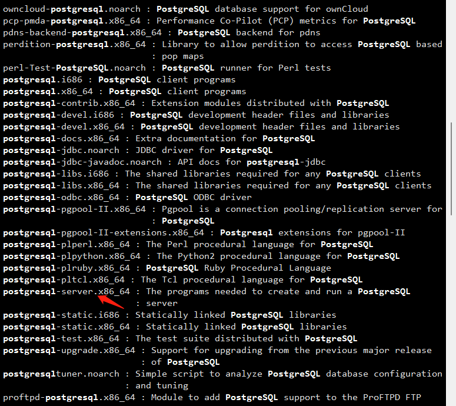
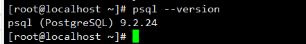
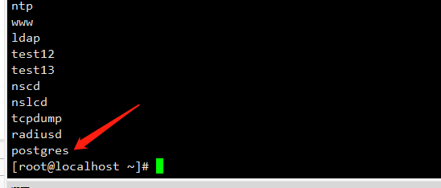
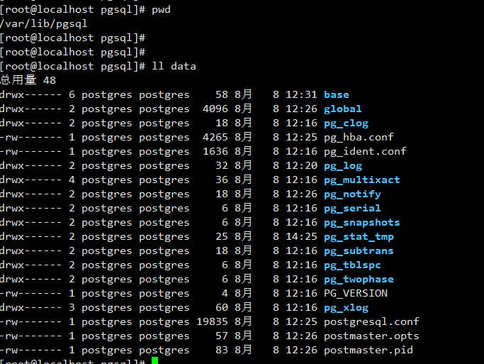
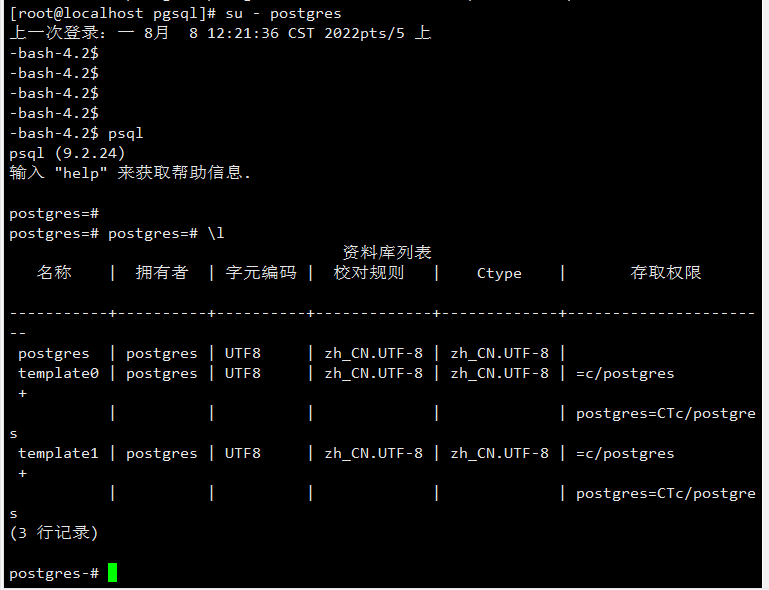
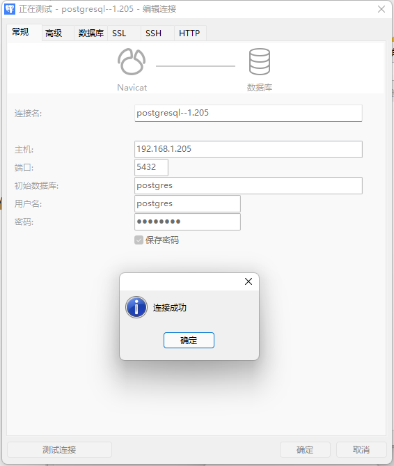

## 1、检查安装源

```shell
yum search postgresql
```




确定为x86_64位

## 2、安装

```shell
yum install postgresql-server
```


### 2.1安装完成后确定命令都已配置好

安装postgresql-server会附带安装上postgres客户端，因此不必重复安装。安装完成，postgresql操作相关的命令都会添加到/usr/bin目录下，可以在命令行下直接使用。

```shell
which psql
which postgresql-setup
whereis postgresql-setup
```

版本信息：

```shell
psql --version
```




### 2.2 查看生成的用户

```shell
cut -d : -f 1 /etc/passwd
```




安装完成的同时，还会生成postgres用户，postgresql启动之后，在本机只能切换到postgres用户下才可以通过psql访问。


## 3、初始化数据库

安装完成之后，不能直接启动数据库，需要先执行初始化，初始化之后，会生成postgresql相关配置文件和数据库文件，他们都会存放在路径/var/lib/pgsql/data下。

```shell
postgresql-setup initdb
```

数据库存储路径：




### 3.1启动数据库

```shell
service postgresql start
service postgresql status
service postgresql restart
netstat -nat
```

启动成功，会监听本机127.0.0.1的5432端口。


## 4、登录配置：

默认情况下，我们使用 `psql -U postgres` 命令登录，使用的是root用户，会提示没有这个角色，需要切换到 `postgres` 用户，然后直接登录。需要设置下 `postgrep` 用户的密码，设置成功后切换到该用户

```shell
passwd postgres
su - postgres
\l 查看所有
\q 退出
```




可以看到通过 `psql` 命令已经登陆成功

需要解决 root 用户下无法通过 `psql -U postgres` 登录的问题，我们需要修改 `/var/lib/pgsql/data` 里的配置文件 `pg_hba.conf` ，将

`local all all peer` 修改为: `local all all trust`


另外，我们需要让外部IP能够连接本机的 `postgresql` ，我们需要修改 `postgresql.conf` 配置文件中的 `listen_addresses` 属性为 `"*"`


并且在 `pg_hba.conf` 配置文件中新增一行配置：

```
host    all    all    0.0.0.0/0    trust
```


修改成功之后，重启数据库服务，监听本机地址发生变化，不再是127.0.0.1了。

```shell
service postgresql restart
```


本地可以在root用户下使用psql -U postgres直接登录了，不会报错。

远程登录的时候，我们需要用户名和密码，这里在windows上使用 `navicat premium`：




