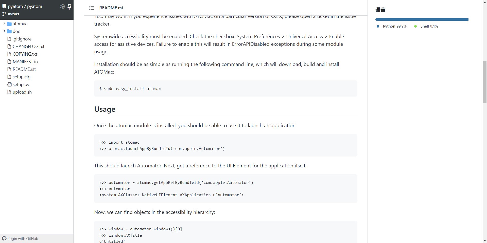

> ATOMac是一个支持在mac上做自动化的python库，
>
> GitHub地址如下：https://github.com/pyatom/pyatom

## 背景

我们公司有款产品的Mac客户端，其中偶发的bug甚多。所以需要写一个小脚本实现自动化操作，捕捉错误。

我平常 web 和 app 自动化做的居多，PC 端应用自动化没有涉猎过。说干就干，找了很多帖子，找到了一个关键词 `ATOMac` 。同时也在github上找到了地址。但是文档真的好少啊！




## 安装依赖库

```shell
# Python2
sudo easy_install atomac

# Python3
pip3 install git+https://github.com/pyatom/pyatom/
```


## 使用

### 启动程序

```python
import atomac
atomac.launchAppByBundleId('com.apple.Automator')
```

> 查看bundleID的方法：打开应用内容 -> info.plist


### 获取Window

```python
automator = atomac.getAppRefByBundleId('com.apple.Automator')
window = automator.windows()[0]
print(window)
```


### 获取应用标题

```python
print(window.AXTitle)
```


### 查看元素

atomac支持获取和操作大部分的元素，可以使用 `xcode` 提供的accessibility inspector快速查看各个元素

> Accessibility Inspector：Xcode -> Open Developer Tools


Atomac支持的元素类型有：

```
textAreas
textFields
buttons
windows
sheets
staticTexts
genericElements
groups
radioButtons
popUpButtons
rows
sliders
```

atomac所有的定位方法加上 `R` 字符，就变成了一个搜索方法(可以添加额外的搜索条件)


### 获取元素

通过快照我们可以进行元素定位, 这里我们以关闭按钮为例

```python
closeButton = window.buttonsR('关闭')[0]
print(closeButton)
```


### 条件搜索元素

atomac支持findFirstR方法，根据属性来进行元素搜索，例如

```python
closeButton = window.findFirstR(AXRole='AXButton', AXTitle='关闭')
```

支持的属性可以在 `Accessibility inspector` 中查看

> findFirstR方法返回首个匹配的元素， 如果没有找到匹配的元素则返回空列表
>
> findAllR使用方法相同，返回所以匹配的元素列表，没有匹配的元素则返回空列表


###  查看元素支持的属性

元素属性对应说明：ATOMac 库使用的元素属性均在其属性名（通过 Accessibility Inspector 查到）前面加 AX，且首字母大写，如下所示

| ATOMac            | Accessibility Inspector |
| ----------------- | ----------------------- |
| AXRole            | Role                    |
| AXPosition        | Position                |
| AXRoleDescription | Type                    |
| AXValue           | Value                   |


```python
closeButton = window.findFirstR(AXRole='AXButton', AXTitle='关闭')
print(closeButton.getAttributes())
```

输出

```
['AXRole', 'AXHelp', 'AXEnabled', 'AXWindow', 'AXSize', 'AXTitle', 'AXRoleDescription', 'AXTopLevelUIElement', 'AXFocused', 'AXParent', 'AXPosition', 'AXFrame', 'AXIdentifier']
```

查看属性值

```python
print(closeButton.AXTitle)
```


### 查看元素支持的操作

```python
print(closeButton.getActions())
```

输出

```
['Press']
```


### 操作元素

```python
closeButton.Press()
```

任何支持的操作都可以这样调用。


### API

| options                                                      | useage           |
| ------------------------------------------------------------ | ---------------- |
| getAttributes()                                              | 获取元素所有属性 |
| getActions()                                                 | 查看元素支持操作 |
| window.tripleClickMouse(x + width / 2, y + height / 2)<br>window.sendKeys('123') | 键盘输入         |
| AXPosition                                                   | 坐标             |
| window.clickMouseButtonLeft(x + width / 2, y + height / 2)   | 左键单击         |
| window.doubleClickMouse(x + width / 2, y + height / 2)       | 双击             |
| window.groups()[0]                                           | 定位             |


### 键盘修饰符

```python
sendKeys([RETURN])
```

| key         | 键盘修饰符      |
| ----------- | --------------- |
| TAB         | `<tab>`         |
| RETURN      | `<return>`      |
| SPACE       | `<space>`       |
| ESCAPE      | `<escape>`      |
| CAPS_LOCK   | `<capslock>`    |
| DELETE      | `<delete>`      |
| NUM_LOCK    | `<num_lock>`    |
| SCROLL_LOCK | `<scroll_lock>` |
| PAUSE       | `<pause>`       |
| BACKSPACE   | `<backspace>`   |
| INSERT      | `<insert>`      |


## 参考

- https://www.cnblogs.com/freedomlidi/p/12431339.html
- https://www.jianshu.com/p/0720dc246770
- https://github.com/pyatom/pyatom