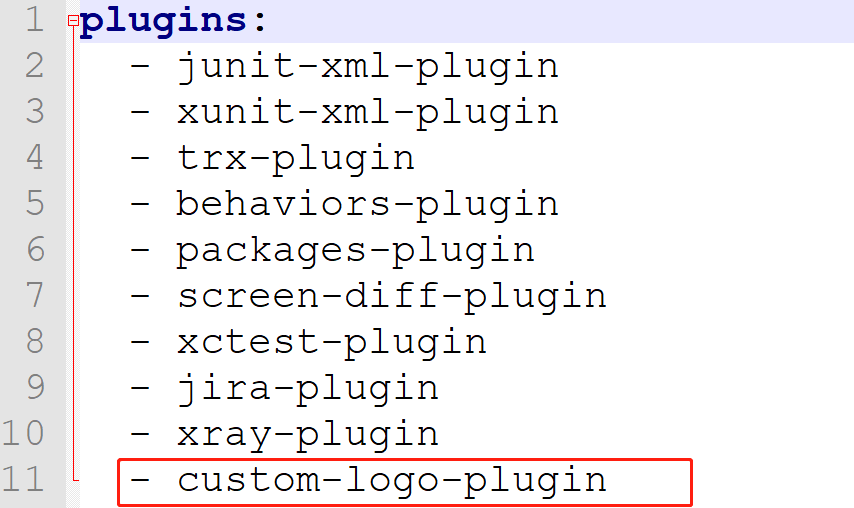

# 修改allure报告自定义的logo和名称


1. 找到allure的安装路径

2. 放置logo到 `\plugins\custom-logo-plugin\static`下

   


3. 修改`style.css` 文件

   ```css
   .side-nav__brand {
       background: url('custom-logo.png') no-repeat left center !important;
       margin-left: 10px;
       height: 50px;
       background-size: contain !important;
   }
   
   
   .side-nav__brand span{
   	display: none;
   }
   .side-nav__brand:after{
       content: "名字";
       margin-left: 20px;
   }
   ```

4. 进入 `\config` 文件夹，修改 `allure.yml`，追加

   

   

   然后重新生成allure报告就可以看到修改后的效果了。