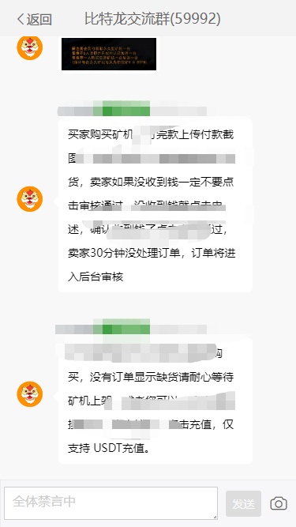

# 【安全】记又一次入侵黑产平台

## 前言

已经记不清又多少次入侵黑产平台了，替天行道！

很多人认为入侵很难，的确也难。给程序找漏洞本来就是一个漫长的过程。想要找漏洞，就得懂的开发程序，会分析代码。这样你就能站在程序的肩膀上，去挖掘其中可能存在漏洞的地方。

## 知识普及

程序最基础的漏洞有：

1. xss注入
2. 参数注入
3. sql注入
4. 文件木马注入


**xss注入：**

一般用于表单的提交，定向收集管理端、用户端的cookie等信息。然后把收集到cookie注入到浏览器中，接下来你就是以一个用户or管理员的身份去操作这个平台，无需登录他的账号。

但是这种注入方式，如果服务端做了session、token、ip白名单等校验，就丧失了它的作用。但是用来进行`刷量`，还是有一定作用的。

**参数注入：**

程序提交数据的时候，都会产生数据包。通过修改里面的参数，模拟发送请求。这种方式，可以绕过前端的校验。但是如果后端做了校验，那还是一样无解。

**sql注入：**

sql注入的语法，大家可以通过百度去了解学习。也是通过修改参数，对数据库中的数据进行增删改查。

具体情况，取决于请求接口的功能。如接口仅用于查询`用户甲`的消费记录。但是我们通过sql注入，也许可以查出平台所有用户的消费记录。

**文件木马注入：**

最常见的如：

一句话木马（图片木马）：通过修改图片中的信息，植入恶意代码。使用菜刀等工具，可以入侵系统服务器。

程序文件木马：比如入侵的平台是php系统，我们上传php木马程序。然后通过访问回显的文件存储地址，就可以实现对系统服务器的控制。

---

## 故事的开始

这次我入侵的是特别有名的虚拟投资诈骗平台。借用`挖Kuang`的名义，骗取用户投资。


这个系统，我研究了一会。感觉除了`聊天`模块，并没有其他入口通知平台的玩家远离诈骗。索性就从聊天模块挖漏洞。


一个群聊-聊天室，一个好友列表-官方客服。

通过私聊作用不大，所以从聊天室入手。



因为一些词语比较敏感，所以我打了马赛克。

平台是`全体禁言的`，所以我们是没有办法发言的。

## 代码的分析

所以，先分析~


聊天的数据包是基于 `WebSocket`协议。

我再查看源代码，


`禁言` 、 `删除消息`、`私信` 等功能都是基于 `WebSocket` 实现通信的。

更何况，这前端的源码中已经帮我们把发送参数的格式罗列好了。直接干就行了。

先创建一个WebSocket对象

```js
//创建WebSocket对象
const ws = new WebSocket("wss://xxx.xxx.com/ws/chatRoom/1534826274126684161");
```

这里的代码：连接 `1534826274126684161` 聊天室

因为系统是禁言状态，我发现用自己的uid发送消息，是无法发送的。说明后端做了校验。

所以我们需要拿到一个管理员的uid，但是这个系统是没有办法查看群员列表的。多亏历史聊天记录中有携带管理员的uid。


然后我通过分析代码，找到了解除禁言的请求参数内容。

```js
ws.send(JSON.stringify({fromUser: '1534480623966617602',message: "", hasImg: 0, type: "forbidAllReject"}));
```

`type` ：代表消息事件的类型--解除禁言

`fromUser` ：发送消息的用户uid。

在控制台执行该代码后，禁言直接就被关闭了。只能说明，后端并没有做登录用户权限的校验。

我接着找到 `发送文字消息` 的请求参数内容。

```js
ws.send(JSON.stringify({fromUser:'1534480623966617602',message:'本平台为诈骗平台，请大家远离诈骗！',hasImg:0,type:'msg'}));
```

我觉得发送文字不够过瘾，接着我又在代码中查找 `发送图片消息` 的参数内容。可是没找到~ 紧接着，我直接拿管理员的账号发送了一张图片，抓到了图片消息的数据包。

步骤：先上传一张图片到平台，然后发送图片消息。

因为浏览器的控制台上传图片并不方便。我使用 `Postman` 实现文件上传。


拿到响应数据中的图片地址，然后就可以发送图片消息。

```js
ws.send(JSON.stringify({"fromUser":"1534480623966617602","message":"/img/20220609/ececfd9853e24ff387b1aae66ae964fb.jpg","hasImg":1,"type":"msg"}));
```

## 效果图


## 结语

技术是一把刀，看你如何去使用它。

远离诈骗，不做韭菜！

